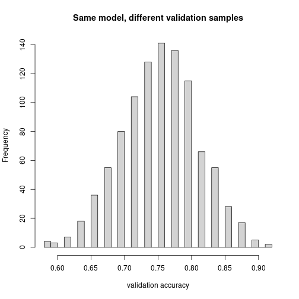

## The setting: model comparison

Everyone has probably heard of overfitting at this point. Here is the setting we care about: model comparison. Say I want to predict survival on the Titanic. I don't know whether I should use `Age`, or `log(Age)`, or whether I should include some variables at all. How do I decide?

## Why training accuracy lies

One obvious thing: throw in everything. The prediction error on the training set is always going to be smaller the more features you include.


``` r
library(titanic)
library(dplyr)
library(tidyr)
train <- titanic_train %>% drop_na(Age)
```

Imagine you include `Name` as a predictor. Names are essentially unique. If your model has one indicator variable per name, it would get 100% training accuracy — every passenger has their own row in the training data and the model just memorizes which name died and which didn't.

But this is **useless on new data**, because a new passenger has a new name, and the model has no idea what to do with it. In fact `predict()` would refuse, because there is no indicator for that name.

More generally: if you add any feature, your training error cannot get worse — at worst you set its coefficient to 0 and recover the old model. So a model with more features always wins on training error.

**Conclusion:** training accuracy is not a useful way to compare models. You need to test on held-out data.

## A three-way split

Split the data into three parts: **training**, **validation**, and **test**.


``` r
n <- nrow(train)
set.seed(1)
idx <- sample(1:n)  # random permutation

train_idx <- idx[1:300]
valid_idx <- idx[301:500]
test_idx  <- idx[501:n]

length(train_idx); length(valid_idx); length(test_idx)
```

```
## [1] 300
```

```
## [1] 200
```

```
## [1] 214
```

`sample(1:n)` jumbles up the indices into a random permutation. Then we slice off the first 300 as training, the next 200 as validation, the rest as test.

A helper that fits a model on training and reports accuracy on a given subset:


``` r
accuracy <- function(model, df){
  preds <- predict(model, newdata = df, type = "response")
  mean((preds > 0.5) == df$Survived, na.rm = TRUE)
}
```

## Compare models on validation, evaluate the winner on test


``` r
df_train <- train[train_idx, ]
df_valid <- train[valid_idx, ]
df_test  <- train[test_idx, ]

# Baseline: just predict the majority class
mean(df_valid$Survived == 0)
```

```
## [1] 0.615
```

``` r
# Model A: sex + age + Pclass
fitA <- glm(Survived ~ Sex + Age + Pclass, data = df_train, family = binomial)
accuracy(fitA, df_valid)
```

```
## [1] 0.77
```

``` r
# Model B: sex + age + Pclass + SibSp + Parch
fitB <- glm(Survived ~ Sex + Age + Pclass + SibSp + Parch,
            data = df_train, family = binomial)
accuracy(fitB, df_valid)
```

```
## [1] 0.755
```

``` r
# Model C: Pclass as categorical
fitC <- glm(Survived ~ Sex + Age + as.factor(Pclass),
            data = df_train, family = binomial)
accuracy(fitC, df_valid)
```

```
## [1] 0.765
```

Pick whichever does best on validation, then evaluate on test:


``` r
best_fit <- fitB  # for example
accuracy(best_fit, df_test)
```

```
## [1] 0.7616822
```

## Why categorical encoding cannot hurt training accuracy

Adding more variables always (weakly) improves training fit. Same is true for treating a numeric column as categorical with `as.factor`.

**Why?** Compare predicting on `Pclass` numeric vs `as.factor(Pclass)`:

- Numeric: $\hat y = a_0 + a_1 \cdot \text{Pclass}$.
- Categorical: $\hat y = b_0 + b_{1,1} I_{\text{class}=1} + b_{1,2} I_{\text{class}=2} + b_{1,3} I_{\text{class}=3}$ (with one dropped as baseline).

(Note: the three-indicator form here is for the sketch of the argument; in `lm` / `glm`, one category gets folded into the intercept, so you actually see two indicator coefficients, not three.)

The categorical version is strictly more flexible. If we set $b_{1,1} = a_1$, $b_{1,2} = 2 a_1$, $b_{1,3} = 3 a_1$, we recover the numeric version. So on training the categorical version cannot do worse — and if it has any room to do better by choosing different coefficients, it will.

On *validation* it might do worse, because that extra flexibility was used to fit noise — overfitting.

## Validation set size and `replicate`

Picking the winner on the validation set can itself mislead — because if your validation set is small, the measured accuracy is noisy. Let's quantify.

We fix the training set and resample the validation set many times. Each time we evaluate the **same** trained model on a different validation slice.


``` r
set.seed(2)
fit <- glm(Survived ~ Sex + Age + Pclass, data = df_train, family = binomial)
other_idx <- setdiff(1:n, train_idx)

resampled_accuracy <- function(){
  v_idx <- sample(other_idx, 50)  # tiny validation set
  accuracy(fit, train[v_idx, ])
}

accs <- replicate(1000, resampled_accuracy())
hist(accs, breaks = 30, col = "lightgray",
     xlab = "validation accuracy",
     main = "Same model, different validation samples")
```



The histogram shows the variability of accuracy estimates from the same trained model. On average you get the kind of performance you actually measure (around 78%), but depending on which validation set you happen to sample, it can be as high as ~85% or as low as ~70% — just due to random sampling.

This should remind you of confidence intervals. There is a "true" performance for a very large validation set; these are estimates around that.

### Conclusion

If your validation set is small, picking the model using it can mean you are picking the model that overfits the validation set rather than the model that is actually best. The larger the validation set, the less the variation.

If you could take *all* the passengers as your validation set, you'd know exactly how the model performs. Of course you can't, because (a) you used some for training and (b) you also wanted some for a final test.

## The trade-off

How to split? A bigger validation set means a more reliable model choice, but you pay for it:

- A smaller training set → the model itself is probably a little worse.
- A smaller test set → your estimate of "how I'll do on truly new data" is also imprecise (it could be up or down).

So you spend data on the validation set, the training set is smaller, the test set is smaller. There is no universally right split — it depends on how much data you have.

A small validation set is the worst situation, because not only do you not know exactly how well any model performs, you are *picking* the best one on that noisy measurement, and the model you pick is biased toward the one that happened to look good by accident.

## What you should know for the test

The topic for the test is the **process**:

- Splitting indices via `sample(1:nrow(df))`.
- A helper function that takes a fit and a dataset and returns accuracy.
- Training one model on the training set, evaluating different candidates on validation, picking the best, then reporting on test.
- Using `replicate(1000, ...)` to estimate the variability of validation-set accuracy when you re-draw the validation set.

The `glm` syntax will be on the handout — you do not need to memorize it.
