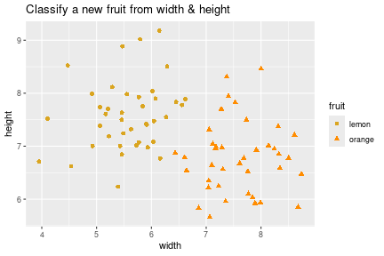
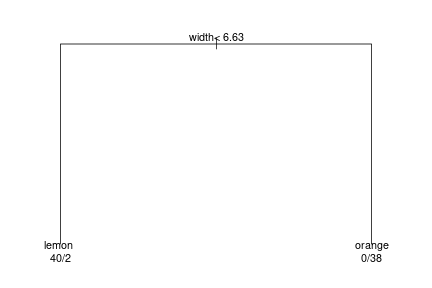
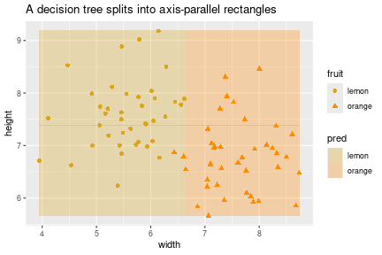

Alongside [neural networks](neural_networks.html), the other workhorse for
prediction — especially on **tabular** data — is the **decision tree**, and its
ensemble cousin the **random forest**. We'll motivate them by comparing how
different classifiers carve up the input space.

## The running example: oranges vs. lemons

Each fruit has a **width** and a **height**; we want to label it *orange* or
*lemon*. A toy dataset:


``` r
set.seed(1)
n <- 40
lemons  <- data.frame(width = rnorm(n, 5.5, 0.7), height = rnorm(n, 7.5, 0.7),
                      fruit = "lemon")
oranges <- data.frame(width = rnorm(n, 7.5, 0.7), height = rnorm(n, 7.0, 0.7),
                      fruit = "orange")
fruit <- rbind(lemons, oranges)
fruit$fruit <- factor(fruit$fruit)

ggplot(fruit, aes(width, height, color = fruit, shape = fruit)) +
  geom_point(size = 2) +
  scale_color_manual(values = c(lemon = "goldenrod", orange = "darkorange")) +
  labs(title = "Classify a new fruit from width & height")
```



## Four ways to draw the boundary

Every classifier we've met carves the feature space differently.

- **k-nearest-neighbours (kNN)** — to label a new point, take its $k$ nearest
  training points and let them **vote**. ($k = 1$ is the plain nearest-neighbour of
  the [neural networks](neural_networks.html) notes.) The boundary is a patchwork
  of little **islands** around clusters of each class.
- **Logistic regression** — a single **straight line** (a hyperplane in higher
  dimensions): one side orange, the other lemon.
- **Neural network** — logistic regression with a more flexible function: a
  **smooth curved** boundary.
- **Decision tree** — repeatedly split the space in half on one feature at a time,
  giving a boundary of **axis-parallel rectangles**.

### kNN, concretely


``` r
library(class)
set.seed(2)
train_idx <- sample(nrow(fruit), 60)
train <- fruit[train_idx, ]
test  <- fruit[-train_idx, ]

pred <- knn(train = train[, c("width", "height")],
            test  = test[,  c("width", "height")],
            cl    = train$fruit, k = 5)
mean(pred == test$fruit)   # accuracy
```

```
## [1] 1
```

kNN needs no "training" beyond storing the data, but it must search all of it at
prediction time, and "nearest" uses raw distances, so feature scaling matters.

## A decision tree

A tree asks a sequence of yes/no questions. At each **internal node** a question
like "is width > 6.5?" sends you left or right; each **leaf** gives a label. It
looks like an upside-down tree — root at top, leaves at the bottom.


``` r
library(rpart)
tree <- rpart(fruit ~ width + height, data = fruit, method = "class")
par(mar = c(1, 1, 1, 1))
plot(tree, margin = 0.1); text(tree, use.n = TRUE, cex = 0.9)
```



Read a prediction by walking root-to-leaf. Notice a tree may **ignore** a feature
entirely if it isn't useful, and may **split on the same feature more than once**
at different thresholds. Let's see the rectangular boundary it induces:


``` r
grid <- expand.grid(
  width  = seq(min(fruit$width),  max(fruit$width),  length.out = 200),
  height = seq(min(fruit$height), max(fruit$height), length.out = 200))
grid$pred <- predict(tree, grid, type = "class")

ggplot() +
  geom_tile(data = grid, aes(width, height, fill = pred), alpha = 0.3) +
  geom_point(data = fruit, aes(width, height, color = fruit, shape = fruit), size = 2) +
  scale_fill_manual(values = c(lemon = "goldenrod", orange = "darkorange")) +
  scale_color_manual(values = c(lemon = "goldenrod", orange = "darkorange")) +
  labs(title = "A decision tree splits into axis-parallel rectangles")
```



## What can a tree represent?

In principle **any** boolean function of the inputs — including patterns a straight
line *can't* separate. The classic one is **XOR / checkerboard**: label $1$ on two
diagonally-opposite corners, $0$ on the other two.


``` r
xor_df <- data.frame(
  x1    = c(0, 0, 1, 1),
  x2    = c(0, 1, 0, 1),
  label = factor(c(0, 1, 1, 0)))
xor_df
```

```
##   x1 x2 label
## 1  0  0     0
## 2  0  1     1
## 3  1  0     1
## 4  1  1     0
```

No straight line separates the two labels, so **logistic regression fails here** —
but a small tree handles it easily (split on `x1`, then on `x2` within each half).

A caveat about that intuition, though: in **two** dimensions lots of things aren't
linearly separable, but with **many** features (say 50), a separating hyperplane
usually *does* exist — our 2-D geometric intuition misleads us. So logistic
regression works far more often than the XOR picture suggests.

The flip side: some simple-looking functions are **hard** for trees. The
**parity** function (output 1 iff an odd number of inputs are 1) is a
high-dimensional checkerboard; a tree can represent it but needs to split on every
feature repeatedly, so it takes a large tree and lots of data. As you allow bigger
trees (more nodes, more depth), the **hypothesis space** — the set of labelings the
tree can express — grows; logistic regression's is always just "which hyperplane?"

## How a tree is learned

Finding the *optimal* tree is NP-hard, so in practice we use a **greedy
heuristic**: grow the tree top-down, at each step picking the split that looks best
*right now*, then **recurse** on each side.

```
learn(data):
  if all labels in `data` are the same -> make a leaf
  else:
    pick the feature (and threshold) whose split is "best"
    partition data into S0, S1 by that split
    learn(S0); learn(S1)      # recurse on each side
```

Details:

- **Discrete feature** → one branch per category. **Continuous feature** → pick a
  **threshold**. You don't try every real number: only values *present in the data*
  can matter, so you try thresholds between adjacent observed values.
- **Which split is "best"?** Simplest: try each feature's best threshold and take
  the one giving the lowest **error rate**, where a not-yet-pure node is labeled by
  **majority vote**. One subtlety — error count can *stay the same* after a useful
  split, so real implementations use an information-theoretic score (information
  gain / Gini) instead of raw error. Same idea, more sensitive.

## Random forests

A single tree is easy to overfit and sensitive to the data. The fix that dominates
tabular-data competitions (e.g. on Kaggle) is the **random forest**: grow **many**
trees — each on a random resample of the data and a random subset of features —
and **average their predictions**. Many trees ⇒ a "forest" (the name is a mild
joke). You rarely build these by hand; a library does it. Empirically, for a
plain table of features with labels, a random forest is often the most accurate
off-the-shelf choice.

## Interpretability

Trees are often sold as **interpretable**: you can read the learned tree and say
"outlook matters most; if it's sunny, then humidity matters." True for a *small*
tree. But two caveats: a tree past a few branches is hard to hold in your head, and
because it was built **greedily**, the feature at the root isn't guaranteed to be
the genuinely most important one. And a random forest — an average of many trees —
loses this transparency almost entirely. So "interpretable" is real but limited.

## Summary

- **kNN**: vote among the $k$ nearest training points; boundary is islands; no
  training, but stores and searches all data.
- Classifiers carve space differently — **line** (logistic regression), **smooth
  curve** (neural net), **axis-parallel rectangles** (tree), **islands** (kNN).
- A **decision tree** asks yes/no questions down to leaf labels; it can represent
  any boolean function (including XOR, which defeats a linear model), but some
  functions (parity) need a huge tree.
- Trees are learned **greedily** (optimal is NP-hard): pick the best split, recurse;
  thresholds come from values in the data; score splits by information gain.
- **Random forests** — averages of many trees — are the go-to for tabular data,
  trading interpretability for accuracy.

## References

- Builds on [neural networks](neural_networks.html) (nearest-neighbour, the model
  comparison) and [logistic regression](logistic_regression.html) (the linear
  boundary).
- Hastie, Tibshirani & Friedman, *The Elements of Statistical Learning*, Ch. 9
  (trees) and Ch. 15 (random forests).
