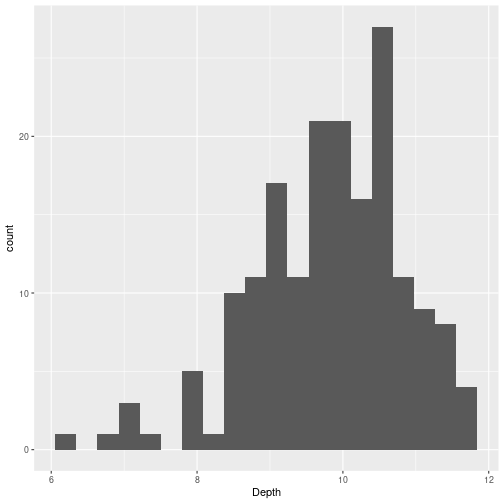
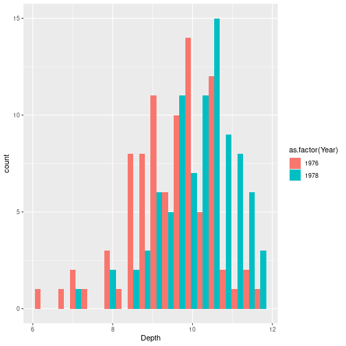
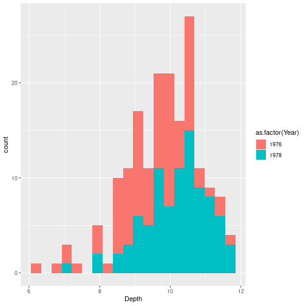
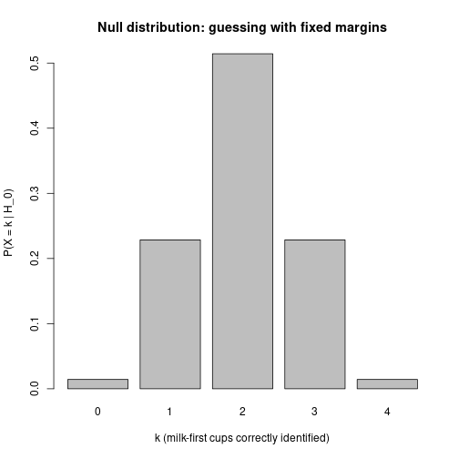
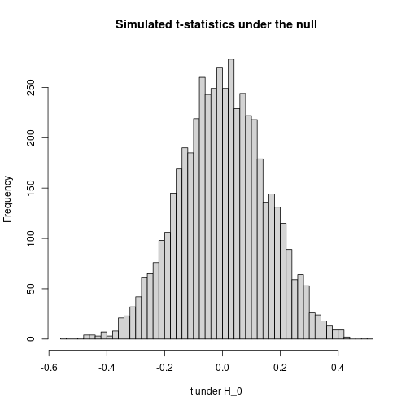
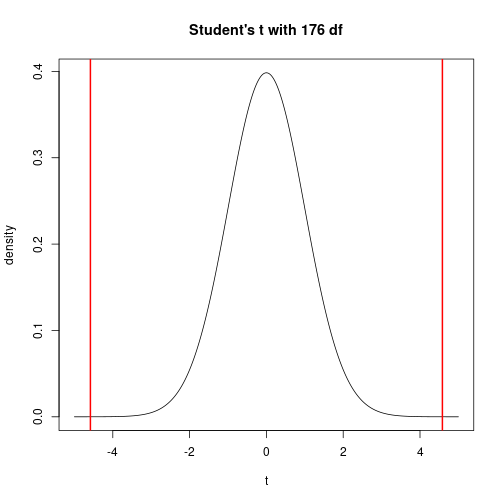

## Darwin's finches data

The data set is the beak depth of Darwin's finches on Daphne Major (one of the Galápagos Islands).

In 1977 — very sadly — there was a drought, and only large tough seeds were available. The hypothesis is that as a result of that, only finches with deep beaks survived. Darwin discovered and named them; the data was collected by a couple of biologists who were originally from the University of British Columbia (so there's a Canadian connection).


``` r
library(Sleuth3)
library(dplyr)
library(ggplot2)
finches <- case0201
head(finches)
```

```
##   Year Depth
## 1 1976   6.2
## 2 1976   6.8
## 3 1976   7.1
## 4 1976   7.1
## 5 1976   7.4
## 6 1976   7.8
```

The data are: the year in which the bird was caught (`Year`), and the depth of its beak (`Depth`). 178 finches total.

### How would you generally analyze this data?

The claim is that maybe the depth of the beaks was different in the different years, because the birds with the bad beaks died out because of the drought. So you could just compute the mean beak depth in 1976 and the mean beak depth in 1978:


``` r
finches %>% group_by(Year) %>% summarize(mean_depth = mean(Depth))
```

```
## # A tibble: 2 × 2
##    Year mean_depth
##   <int>      <dbl>
## 1  1976       9.47
## 2  1978      10.1
```

Indeed, in 1978 the mean depth was slightly higher than in 1976. But this by itself doesn't tell us anything — you could always say "maybe this is just random".

### Visualize

Usually the second thing you would do — we're not running a statistical test yet — is just display the data in a way that would tell us whether the data is really random or not.


``` r
ggplot(finches, aes(x = Depth)) + geom_histogram(bins = 20)
```



This doesn't tell us much because it's not broken down by year. We can break it down by year by mapping color (or fill) to year. But there is a small finickiness: `Year` is numeric in this data set, so we need to convert it to a factor first:


``` r
ggplot(finches, aes(x = Depth, fill = as.factor(Year))) +
  geom_histogram(bins = 20, position = "dodge")
```



`color` in ggplot is the outline; `fill` is the color inside the bar. `as.factor(Year)` converts the numerical column to a categorical variable, which is what `fill` (or `color`) needs.

`position = "dodge"` displays the two histograms side by side. The default `"stack"` stacks them:


``` r
ggplot(finches, aes(x = Depth, fill = as.factor(Year))) +
  geom_histogram(bins = 20, position = "stack")
```



The stacked version is kind of one histogram if you ignore the color, but kind of two histograms if you look at the separate colors. It is nice but kind of unreadable. The dodge version actually shows something that makes sense.

It does kind of look like that the distribution for 1976 looks different from the distribution for 1978. The way it would look if there was no real difference is if you saw two overlapping Gaussians with the same center. Here it seems pretty clear those are two Gaussians at different locations.

## The null hypothesis

What you usually get taught in introductory statistics is that you need to have a **null hypothesis** and then see whether you can reject it.

Here the null hypothesis is: nothing is going on, i.e., the difference between the means of the two distributions is zero:

$$H_0:\ \mu_{1976} = \mu_{1978}.$$

We reject $H_0$ when the **p-value** is less than 5% (by convention).

The p-value is the probability of observing a deviation at least as large as what's in the data, assuming the null hypothesis is true.

## Reject vs accept

A common thing they tell you, and I agree with, is that **you can only ever reject the null hypothesis; there is no accepting the null hypothesis**.

The reason for this: the p-value, when you can compute it, is the amount of evidence you have *against* the null hypothesis being true. There are two ways you can have "not enough evidence against $H_0$":

1. The null hypothesis is true — it's hard to get evidence against something when it's true.
2. You don't have a lot of evidence at all — e.g., you only caught 3 birds in each year. The p-value will quite likely be large, but that doesn't mean we should accept $H_0$; it just means we don't have evidence against $H_0$, possibly just because we don't have enough evidence for anything at all.

### Why is the null hypothesis usually "$=0$"?

Why not something like "the difference is 0.1"? Conceptually it makes no sense: if your null hypothesis is just a made-up number like 0.1, that's got to be false anyway, so why are you looking for evidence against it? You could just say a priori that it's some number, but it's definitely not 0.1 exactly.

Zero is a little different because zero really says "pre-drought and post-drought populations are the same." Conceptually, the null hypothesis should conceivably be true. If you reject it, that means that you've learned something new — the populations in 1976 and 1978 are genuinely different. Another argument for only rejecting the null hypothesis: by default you would rather keep believing that nothing interesting is going on than start believing that something is going on. So by default you say "I don't know what the difference is, so I'll assume they're the same."

## Test statistic

The way I presented this informally was: what's the probability that we'll see a difference that's at least as large as what we have here? We've got to operationalize this somehow — because what we have is a histogram where it looks like the colors are different, but we want a number.

The way you usually do it is to compute a **test statistic** — a function of the observed sample.

A first try: the difference of means in 1978 minus 1976. That's now a number. But it is not super useful, because you might get a number like 0.5 mm. That doesn't tell you anything about whether that's a big difference or a small difference. What you want to know is, in terms of the spread of the entire histogram, how large is the difference between the means?

If the histograms are really tiny, a difference of a few millimeters would be meaningful. If they are very spread out, a difference of millimeters might be nothing.

A more useful test statistic: divide by the standard deviation:

$$t = \frac{\bar{d}_{1978} - \bar{d}_{1976}}{\text{sd}(d)}.$$

This tells you the difference between the distributions on the scale on which the data actually exists.

A caveat about terminology: the formula above — divide by the SD of the data — is a **pedagogical simplification**, useful because the denominator is something you can read off a histogram. The actual two-sample $t$-statistic that `t.test` computes divides by something slightly different (the *standard error of the difference of means*); we'll meet it in Method 3 below. The two statistics are not literally the same number, but they're closely related and both function the same way for hypothesis testing: bigger absolute value = stronger evidence against $H_0$.


``` r
means_by_year <- finches %>% group_by(Year) %>% summarize(m = mean(Depth))
sd_all <- sd(finches$Depth)

t_obs <- (means_by_year$m[2] - means_by_year$m[1]) / sd_all
t_obs
```

```
## [1] 0.6512421
```

(Yes — coincidentally — it is about 0.67.)

## Three ways to find a null distribution

A test statistic by itself isn't enough. We need to know **what values it tends to take when $H_0$ is true** — its **null distribution** — so we can judge whether the value we actually observed is surprising.

The p-value, formally, is

$$\text{p-value} = P\big(\, |T| \geq |t_\text{obs}| \,\big|\, H_0 \big).$$

So the whole game is: get the distribution of $T$ under $H_0$, then look up the tail probability beyond $t_\text{obs}$.

There are three classical ways to get that distribution:

1. **Enumerate it.** When the data is small and discrete, you can just write down every possible outcome under $H_0$ and count.
2. **Simulate it.** Pick a model where $H_0$ holds, draw fake data many times, recompute the statistic each time, and look at the histogram.
3. **Look it up.** Sometimes the statistic has been studied enough that its null distribution is known in closed form.

We'll do one example of each. Method 1 uses a small, classic experiment (the Lady Tasting Tea). Methods 2 and 3 both use the finches data.

# Method 1: Enumerate — the Lady Tasting Tea

This is the classic example, from Fisher's 1935 book *The Design of Experiments*. The story is from a tea party in Cambridge in the 1920s. A colleague of Fisher's — Muriel Bristol, an algae biologist — said she could tell, just by drinking it, whether the milk had been poured into the cup before the tea or the other way around. The chemists at the table were skeptical: how could that possibly make a difference? Fisher said: OK, let's design an experiment.

Here is the experiment. You make 8 cups of tea. In 4 of them you pour the milk first. In the other 4 you pour the tea first. You present them to her in a random order, and ask her to say, for each cup, whether the milk went in first. The test statistic is the obvious one: the number of cups she gets right.

(She got all 8 right, as it turned out. Whether that was because she really had the ability, or because there was some subtle experimental tell, is part of statistical folklore.)

$H_0$: she cannot taste the difference, and is just guessing. To turn that into a null *distribution* for the test statistic we have to say what "guessing" means — and there are two reasonable models, which give different numbers.

**What's in the video:** the first model — treat each of the 8 cups as an independent coin flip, so the number correct is **Binomial$(8, \tfrac12)$**. The instructor presented this as the quick intuition, flagged it as the simplified version ("I'm not going to do the combinatorics"), and said it would not be tested.

**What's *not* in the video:** the second model — Fisher's *actual* design fixes the margins (she is told there are exactly 4 of each), which makes the score **Hypergeometric**. That is the version with a name, **Fisher's exact test**, and the one R computes. We work it out below because it is what Fisher actually did.

## A first pass: each cup an independent guess — the video's binomial

The simplest way to model "guessing" is: for each of the 8 cups she independently calls a coin flip — "milk first" or "tea first." Each cup is then an independent Bernoulli($\tfrac12$) trial, so the number she gets right is a **Binomial$(8, \tfrac12)$** random variable, and the $2^8 = 256$ guess sequences are all equally likely. (The "$2^n$" is the same counting we keep using: 2 ways for the first cup, times 2 for the second, and so on.)

The number of those 256 sequences that get **7 or more cups right** is small: she could miss exactly one of the 8 cups ($\binom{8}{1} = 8$ ways) or miss none ($\binom{8}{0} = 1$ way). This is just the upper tail of that binomial — $P(C = j) = \binom{8}{j} / 2^8$, so $P(C \geq 7)$.


``` r
total      <- 2^8
ge7        <- choose(8, 7) + choose(8, 8)   # at least 7 of 8 correct
c(total = total, favorable = ge7, p_value = ge7 / total)
```

```
##        total    favorable      p_value 
## 256.00000000   9.00000000   0.03515625
```

``` r
# the same p-value, straight from the Binomial(8, 1/2) upper tail:
pbinom(6, size = 8, prob = 0.5, lower.tail = FALSE)
```

```
## [1] 0.03515625
```

So $P(\text{at least 7 right} \mid H_0) = 9/256 \approx 0.035$ — below 5%, so 7 or 8 correct would let us reject. What about 6 of 8?


``` r
(choose(8, 6) + choose(8, 7) + choose(8, 8)) / 2^8
```

```
## [1] 0.1445312
```

About 14% — **not** enough. Under this (video) model she has to get 7 or 8 of the 8 cups right.

## The real experiment fixes the margins — Fisher's exact test (not in the video)

Fisher's actual design has one more ingredient: she is **told in advance that there are exactly 4 of each**, and must label exactly 4 cups "milk first." That constraint changes the counting, because she is no longer making 8 free guesses — she is choosing *which* 4 of the 8 cups to call "milk first."

There are $\binom{8}{4} = 70$ ways to do that, and under $H_0$ each is equally likely.

The constraint has a striking consequence: **her errors come in pairs.** If she wrongly labels one true-tea cup "milk first," she has used up one of her four "milk first" labels, so she must also fail to label one true-milk cup. So the number of cups she gets right is **always even** — 0, 2, 4, 6, or 8 — and a score of exactly 7 is *impossible*. (That is why the "$\geq 7$" framing above only makes sense in the independent-guess model.) The natural statistic here is instead $X$ = how many of the 4 milk-first cups she correctly identifies, which ranges 0–4.

The count for each $k$ is hypergeometric:

$$P(X = k \mid H_0) = \frac{\binom{4}{k}\binom{4}{4-k}}{\binom{8}{4}}.$$

Of the 4 cups that actually had milk first, she picks $k$ to call "milk first" ($\binom{4}{k}$ ways); of the 4 that had tea first, she wrongly calls $4-k$ of them "milk first" ($\binom{4}{4-k}$ ways). Divide by 70.


``` r
k <- 0:4
p_k <- choose(4, k) * choose(4, 4 - k) / choose(8, 4)
data.frame(k = k, count = choose(4, k) * choose(4, 4 - k), prob = p_k)
```

```
##   k count       prob
## 1 0     1 0.01428571
## 2 1    16 0.22857143
## 3 2    36 0.51428571
## 4 3    16 0.22857143
## 5 4     1 0.01428571
```

The counts come out 1, 16, 36, 16, 1 — adding to 70. (In terms of cups-correct, $k$ milk cups right means $2k$ cups right overall: 0, 2, 4, 6, 8.)


``` r
barplot(p_k, names.arg = k,
        xlab = "k (milk-first cups correctly identified)",
        ylab = "P(X = k | H_0)",
        main = "Null distribution: guessing with fixed margins")
```



This is the *whole* null distribution — no simulation, no normality assumption, just 70 equally likely outcomes counted up.

## The p-value

If she identifies all 4 milk-first cups, the (one-sided) p-value is

$$P(X \geq 4 \mid H_0) = \frac{1}{70} \approx 0.014,$$


``` r
1 / 70
```

```
## [1] 0.01428571
```

below 5%, so we reject $H_0$. If she had gotten only 3 of the 4:

$$P(X \geq 3 \mid H_0) = \frac{16 + 1}{70} \approx 0.243,$$


``` r
(16 + 1) / 70
```

```
## [1] 0.2428571
```

not below 5%. So with this design only a perfect score counts as evidence. With 6 cups instead of 8 you could not get a small p-value even with a perfect score — the null distribution lets you reason about that before running the experiment.

## Why the two models give different numbers

Both are exact tests — enumerate every equally-likely outcome under $H_0$ and count the fraction at least as extreme as observed. They differ only in **what counts as a possible guess**, which is set by the experimental design:

| | Independent guesses | Fixed margins (Fisher) |
|---|---|---|
| She is told there are 4 of each? | no | yes |
| Sample space | $2^8 = 256$ sequences | $\binom{8}{4} = 70$ partitions |
| Distribution of the score | Binomial$(8, \tfrac12)$ | Hypergeometric |
| Cups-correct can be | any of 0–8 | only even: 0, 2, 4, 6, 8 |
| Perfect-score p-value | $1/256 \approx 0.004$ | $1/70 \approx 0.014$ |
| Reject at 5% when | $\geq 7$ of 8 | all 4 milk cups (= all 8) |

So, stated cleanly: **Fisher's exact test is the fixed-margin model** — the margins (4 of each) are fixed in advance, the score is Hypergeometric, and the perfect-score p-value is $1/70$. That, and only that, is what `fisher.test` computes. The independent-guess model — score $\sim$ Binomial$(8, \tfrac12)$, perfect-score p-value $1/256$ — is **not** Fisher's exact test. It is a fine quick intuition for "enumerate the possibilities," but it is a different model with a different distribution, and `fisher.test` will not reproduce its numbers.

## Doing it by simulation, as a sanity check

We can rebuild the fixed-margin null distribution by simulating random guessing — shuffling the 4/4 labels — to confirm the closed form:


``` r
set.seed(7)
truth <- c(rep("milk", 4), rep("tea", 4))

random_guess <- function(){
  guess <- sample(truth)                       # a random 4/4 relabelling
  sum(guess == "milk" & truth == "milk")       # milk cups correctly identified
}

sims <- replicate(20000, random_guess())
round(rbind(exact = p_k,
            simulated = as.numeric(table(factor(sims, levels = 0:4))) / length(sims)), 3)
```

```
##            [,1]  [,2]  [,3]  [,4]  [,5]
## exact     0.014 0.229 0.514 0.229 0.014
## simulated 0.014 0.231 0.513 0.228 0.014
```

`sample(truth)` permutes the labels while keeping exactly 4 of each, so it draws from the *fixed-margin* model — and the simulated frequencies match the hypergeometric `p_k`, up to Monte Carlo noise.

## Fisher's exact test

The fixed-margin procedure has a name — **Fisher's exact test** — and an R function:


``` r
tea_table <- matrix(c(4, 0,
                      0, 4),
                    nrow = 2, byrow = TRUE,
                    dimnames = list(guess = c("milk", "tea"),
                                    truth = c("milk", "tea")))
fisher.test(tea_table, alternative = "greater")
```

```
## 
## 	Fisher's Exact Test for Count Data
## 
## data:  tea_table
## p-value = 0.01429
## alternative hypothesis: true odds ratio is greater than 1
## 95 percent confidence interval:
##  2.003768      Inf
## sample estimates:
## odds ratio 
##        Inf
```

The reported p-value is $1/70 \approx 0.014$, exactly what we got by hand from the hypergeometric distribution.

# Method 2: Simulate — finches with our pedagogical $t$

Back to the finches. Our test statistic was

$$t = \frac{\bar{d}_{1978} - \bar{d}_{1976}}{\text{sd}(d)}, \qquad t_\text{obs} \approx 0.67.$$

We can't enumerate the null distribution here — beak depths are continuous, and there are infinitely many possible samples. Instead, we **simulate**: we pick a model in which $H_0$ holds, generate fake data many times, recompute $t$ each time, and look at the histogram.

## Generating fake data under the null

We need a model for the data: it looks approximately normal. Let's get the per-year counts:


``` r
finches %>% group_by(Year) %>% summarize(n = n())
```

```
## # A tibble: 2 × 2
##    Year     n
##   <int> <int>
## 1  1976    89
## 2  1978    89
```

89 of each. Now we generate data: approximately normal with the same mean and same SD in both years (so the null is true). What mean and SD?

For the mean it doesn't matter, because under $H_0$ the means are the same and our test statistic is a difference, so any common mean cancels. But let's use the overall mean:


``` r
mean_all <- mean(finches$Depth)
mean_all
```

```
## [1] 9.803933
```

For the SD it is a little trickier. If I compute the SD of all the depths together (`sd(finches$Depth)`), that is the *wrong* SD — because if 1976 and 1978 actually differ in mean, the overall SD picks up the between-group separation as well as the within-group spread. We want the within-group SD. Let's check:


``` r
finches %>% group_by(Year) %>% summarize(sd = sd(Depth))
```

```
## # A tibble: 2 × 2
##    Year    sd
##   <int> <dbl>
## 1  1976 1.04 
## 2  1978 0.906
```

About 1 in both groups (a bit smaller than the overall SD). So we'll use $\sigma \approx 1$.

## Simulating many $t$-statistics under $H_0$


``` r
n1 <- 89
n2 <- 89

random_t <- function(n1, n2, mu = mean_all, sd = 1){
  d1 <- rnorm(n1, mean = mu, sd = sd)
  d2 <- rnorm(n2, mean = mu, sd = sd)
  (mean(d2) - mean(d1)) / sd(c(d1, d2))
}

set.seed(3)
replications <- replicate(5000, random_t(n1, n2))
```

`replicate` is just a one-liner for a `for` loop — it runs the same expression $n$ times and collects the results in a vector.

## The histogram of $t$-statistics under $H_0$


``` r
hist(replications, breaks = 40, col = "lightgray",
     xlab = "t under H_0", main = "Simulated t-statistics under the null")
abline(v = t_obs, col = "red", lwd = 2)
abline(v = -t_obs, col = "red", lwd = 2)
```



The red lines mark $\pm t_\text{obs}$. From here we can already see whether we should reject the null hypothesis: getting a value as far away from zero as 0.67 is rare.

## The p-value (by simulation)


``` r
mean(abs(replications) >= abs(t_obs))
```

```
## [1] 0
```

It is essentially zero.

The intuition is: if the difference between the samples that we actually observed would be highly unlikely under the null hypothesis, then we can reject the null.

### What simulation gave us

We got the null distribution **without doing any math** beyond defining the test statistic. As long as we can write a function that computes the statistic, and as long as we can simulate data under $H_0$, we can compute a p-value. That generality is the reason simulation is the workhorse of modern statistics.

What it cost us: 5000 random draws, a choice of how many iterations to run, some Monte Carlo noise in the answer, and the need to commit to a generative model (normal with $\sigma \approx 1$) just to draw fake data.

# Method 3: Known closed form — Student's $t$-distribution

For this particular setup — comparing the means of two normal samples with equal variance — someone has already done the math for us.

## The textbook $t$-statistic

The **two-sample $t$-statistic** (with pooled variance) is

$$T = \frac{\bar{X}_2 - \bar{X}_1}{s_p \sqrt{\dfrac{1}{n_1} + \dfrac{1}{n_2}}}, \qquad s_p^2 = \frac{(n_1 - 1) s_1^2 + (n_2 - 1) s_2^2}{n_1 + n_2 - 2}.$$

It's the same difference of means we've been using, but divided by the **standard error of the difference of means** — an estimate of how much $\bar{X}_2 - \bar{X}_1$ itself would fluctuate from sample to sample, not how much the data fluctuates.

That denominator is the principled choice for hypothesis testing: it asks "given how noisy our *estimate of the difference* is, how big is the observed difference?"

## The known null distribution

The remarkable fact, due to William Gosset ("Student," 1908):

> If the data are normal with equal variance under $H_0$, then $T \sim t_{n_1 + n_2 - 2}$ — Student's $t$-distribution with $n_1 + n_2 - 2$ degrees of freedom.

This distribution has a name, a formula, and a built-in R function. We don't need to simulate it. Before the era of cheap computing, this was the *only* way two-sample tests could be done — you would look up critical values of $t_\text{df}$ in a printed table in the back of a textbook.

## Computing it on the finches


``` r
finches_1976 <- finches$Depth[finches$Year == 1976]
finches_1978 <- finches$Depth[finches$Year == 1978]

n1 <- length(finches_1976); n2 <- length(finches_1978)
m1 <- mean(finches_1976);   m2 <- mean(finches_1978)
s1 <- sd(finches_1976);     s2 <- sd(finches_1978)

s_p <- sqrt(((n1 - 1) * s1^2 + (n2 - 1) * s2^2) / (n1 + n2 - 2))
t_textbook <- (m2 - m1) / (s_p * sqrt(1/n1 + 1/n2))
t_textbook
```

```
## [1] 4.583276
```

And the p-value, looked up from $t_{176}$:


``` r
df <- n1 + n2 - 2
2 * pt(-abs(t_textbook), df = df)
```

```
## [1] 8.649515e-06
```

`pt(q, df)` is the CDF of the $t$-distribution. We compute twice the area to the left of $-|t_\text{obs}|$ — i.e., the total probability under the null density beyond $\pm t_\text{obs}$.

## The picture


``` r
xs <- seq(-5, 5, length.out = 400)
plot(xs, dt(xs, df = df), type = "l",
     xlab = "t", ylab = "density",
     main = paste0("Student's t with ", df, " df"))
abline(v = t_textbook, col = "red", lwd = 2)
abline(v = -t_textbook, col = "red", lwd = 2)
```



This is the same kind of plot as the simulated histogram from Method 2 — except instead of being an empirical histogram of 5000 draws, it is the **exact** null density. The simulated histogram from Method 2 is converging to a rescaled version of this curve as the number of replications grows.

## R's built-in


``` r
t.test(Depth ~ Year, data = finches, var.equal = TRUE)
```

```
## 
## 	Two Sample t-test
## 
## data:  Depth by Year
## t = -4.5833, df = 176, p-value = 8.65e-06
## alternative hypothesis: true difference in means between group 1976 and group 1978 is not equal to 0
## 95 percent confidence interval:
##  -0.9564088 -0.3806698
## sample estimates:
## mean in group 1976 mean in group 1978 
##           9.469663          10.138202
```

The reported `t = …` matches `t_textbook`. The reported `df = 176` is what we plugged into `pt()`. The reported p-value matches what we just computed. `t.test` is just packaging Method 3.

## What Method 3 buys us

1. **No simulation needed.** One function call. No iteration count, no Monte Carlo noise.
2. **No need to specify a full data-generating model.** Method 2 had to *generate* fake data, which forced a choice of $\sigma$. Method 3 only needs the *distribution of the test statistic*; the data values are summarized by $\bar{X}$ and $s_p$ and the $t$-distribution does the rest.

The catch: Method 3 only works because Gosset did the math. Method 2 (simulation) works for *any* test statistic you can write down, even one nobody has ever studied. That is why we presented simulation first: it always applies. Method 3 is the prize you get when your problem happens to match a well-studied family.

# One-sided vs two-sided p-values

In the finches code above, we used **absolute values** — that's a two-sided p-value. On a slide-only treatment people often write the one-sided version:

$$P(T \geq t_\text{obs} \mid H_0).$$

Which to do depends on what you think is going on in the data:

- The **one-sided** p-value asks: I observed $t = 0.67$. I only ever expect a positive difference. What is the probability of an even larger positive difference?
- The **two-sided** p-value asks: I have no idea what kind of difference there's going to be. I happen to get a positive value, but a negative one would have been just as surprising.

This is a little bit vague but that is just how it is — there is no neat resolution. It is about whether you are just saying "I have no idea what's going on, maybe 1976 is larger, maybe 1978 is larger" or whether you have a prior reason to believe the difference can only go one way.

The tea example is one of those rare cases where one-sided really is the right call: a high count means she can taste the difference and is labelling correctly, and that's the only direction the alternative goes (by convention).

For the finches: most of the time you want the two-sided p-value. You need a really strong argument for why it would be one-sided.

# Comparing the three approaches

The conceptual content of all three methods is identical: a p-value is the fraction of equally-likely-under-$H_0$ outcomes that are at least as extreme as the one we observed. What changes is the technical machinery for computing that fraction.

| Method | How you get the null distribution | When it works | What it costs | Example here |
|---|---|---|---|---|
| **1. Enumerate** | List every outcome under $H_0$ and count | Sample space is small and discrete | Nothing — exact answer | Lady Tasting Tea: $1/70$ |
| **2. Simulate** | Generate fake data under $H_0$ many times, recompute $T$ each time | Almost always (you just need to write down a generative model) | Monte Carlo noise; you have to specify a full data-generating model | Finches with $t = (\bar d_2 - \bar d_1) / s$ |
| **3. Closed form** | Look up the known distribution of $T$ under $H_0$ | Only for statistics whose null distributions have been worked out | Nothing computationally; but someone had to do the math first | Finches with the textbook two-sample $t$ and Student's $t_{n_1 + n_2 - 2}$ |

### The formal frame, in any case

- **Null hypothesis**: a statement that "nothing is going on" — e.g., $H_0:\ \mu_X = \mu_Y$ for the finches, or "she's guessing" for the tea.
- **Test statistic**: $T = T(\text{sample})$. A function of the data, and therefore itself a random variable.
- **Null distribution of $T$**: the distribution of $T$ when $H_0$ is true. Get it via Method 1, 2, or 3.
- **p-value**: $P(\,|T| \geq |t_\text{obs}|\,|\,H_0)$. The tail probability of the null distribution beyond what we observed.
- **Decision rule**: reject $H_0$ at the 5% level if p < 0.05.

# Reading the output

- If $p < 0.05$: there is evidence against $H_0$. The data we observed would be unlikely if $H_0$ were true, and we did observe it, so that is evidence against.
- If $p$ is large: there is no (or weak) evidence against $H_0$. What we see would not be surprising if $H_0$ were true.
