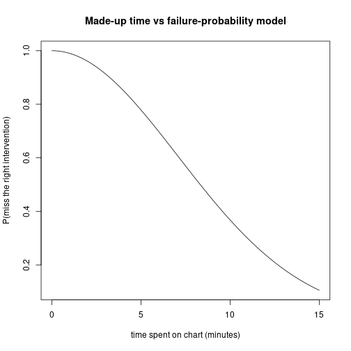

This topic walks through the second mini-project — predicting adverse outcomes for patients in the ICU — including the cost model that turns a model's ROC curve into a concrete threshold-selection question.

## The setting

The data set is from the ICU (intensive care unit) of a Boston hospital. The general situation in an ICU: if you are in an ICU you are not doing well — you have a high probability of mortality.

There are technically different kinds of ICUs:

- **Surgical ICU.** After even very low-risk surgeries (e.g., an appendectomy), you go into the surgical ICU. That generally means you are fine.
- **Medical ICU / transferred from emergency.** You could be transferred to the ICU from emergency or from general medicine because they think you're about to die. In which case you are probably not doing well.

So it kind of depends; in general, for these kinds of datasets, depending on the population, around 50% of patients have an adverse outcome.

In this project, "adverse outcome" is defined as **mortality**. You could also look at transfers to palliative care — palliative care meaning care that's not meant to prolong life so much as make the person comfortable, which happens when the expectation is the patient will pass away soon. Either of these flags is a useful proxy for "this person is getting worse."

## Why this matters

If you can predict which patients are going to deteriorate, you can intervene. The idea is: if you know ahead of time that a patient is about to deteriorate, maybe you can do something about it, so maybe they will not deteriorate after all. (Or if they do deteriorate, you reach them faster.)

A system like this was actually implemented in many hospitals — one in Ontario, several in the UK. On the pager, the staff would get a page if the system flagged the patient as likely to deteriorate or be transferred to palliative care.

Unfortunately, the system had a lot of false positives, and the doctors and nurses who got those pages learned to ignore them. That was one of the motivations for designing this project: how do we figure out how to use this kind of system in a way that actually improves outcomes?

## The data and processing

The data is multiple text files. The mini-project gives you code that:

1. Loads the per-file measurements.
2. For every patient, aggregates measurements (e.g., taking the mean heart rate, mean temperature; age is constant so you don't aggregate that).
3. Builds one data frame with one row per patient.

Once you've run all that code, you have a single data frame on which you do logistic regression to predict mortality.

## Logistic regression

You use a specified set of predictor variables (mean heart rate, mean urine output, mean temperature, age, etc.). The model is:

$$P(\text{mortality} = 1) = \sigma(\text{linear combination of predictors}).$$

You fit on training data and evaluate on a validation set.

## The ROC curve

You are asked to plot an **ROC curve**, which shows the trade-off between the **false positive rate** and the **true positive rate**.

- If you always predict "no", FPR is 0 but TPR is also 0.
- If you always predict "yes", TPR is great but FPR is bad.
- In between, you sweep a threshold for "predicted probability above which we declare positive". Each threshold gives one (FPR, TPR) point.

You read the graph to answer questions about the model.

## The cost model: "doctor with 25 charts"

This is where it gets interesting. We are saying: how useful is this model in actual hospital practice?

The model:

1. **At the beginning of a shift, a doctor reviews all the patients' charts.** True in real hospitals.
2. **They decide if an intervention is needed.** If the doctor intervenes correctly, the patient does not die (or has a lower probability). If the doctor does not intervene correctly, the patient does die (or has some probability of dying).
3. **A doctor takes about an hour to look through 25 patient charts.** Realistic numbers.
4. **There is a probability of missing the correct treatment, which depends on how much time the doctor spends reviewing.** Spend more time, lower probability of missing.

So far this is plausible.

### The made-up part: probability as a function of time

We need a formula for the probability of failing to come up with the right intervention as a function of the time $t$ spent reviewing. We make one up:

$$p(\text{fail} \mid t) = \exp\!\left(-\frac{t^2}{100}\right).$$

If $t$ is large, $-t^2/100$ is very negative, so $\exp(\cdot)$ is basically 0 — failure rate is essentially zero. If $t$ is tiny, the exponent is close to zero, so the probability of failure is close to 1. This formula is not based on anything other than "this gives a really nice graph at the end." We are not claiming the world really works like this.


``` r
fail_prob <- function(t) exp(-t^2 / 100)
ts <- seq(0, 15, by = 0.1)
plot(ts, fail_prob(ts), type = "l",
     xlab = "time spent on chart (minutes)",
     ylab = "P(miss the right intervention)",
     main = "Made-up time vs failure-probability model")
```



### The alert system gives a trade-off

Without the alert system, the doctor spends about $60/25 = 2.4$ minutes per chart on average.

With the alert system: you only spend time on the charts that are flagged as likely to deteriorate. The patients who are not flagged: you spend less time on them (you don't need to look at their chart at all in the strict version; in a more realistic version you spend less time on patients with low predicted risk but not zero).

### Picking a threshold

We sweep possible thresholds: "the doctor only pays attention to charts above a given probability of adverse outcome."

- Threshold = 0: review everything carefully → no time per chart → high failure rate.
- Threshold = 1: review nothing → no time spent on anyone → everyone untreated.
- Threshold somewhere in between: the right balance.

For every threshold, you can compute the **average number of patients expected to die**. With this formula, it turns out there is a very clear optimum point where it actually makes sense to spend more time on patients above a certain threshold.

Your task in part 5B of the mini-project is to make the graph: threshold on the x-axis, average number of people expected to die on the y-axis. The graph has a clear minimum which you find and report.

## What can be tested

The mini-project is the basis for ~70% of the test. Specifically:

- **Part 2 (running the logistic regression).** You need to be able to write the `glm(... ~ ..., family = binomial)` formula and interpret coefficients. (Like the sample test on Titanic.)
- **Training / validation split.** What does it mean and why.
- **ROC plotting.** Producing the plot is not required for the test; reading it is. A possible test question: here is the plot; come up with a reasonable criterion for selecting a threshold.

### Sample exam-style question

> Here is a plot of FPR vs TPR with several points labelled with their threshold. Come up with a reasonable criterion for selecting a threshold and apply it.

There is not one right answer. Reasonable arguments to make:

- FPR = 0 or TPR = 0 makes no sense — that's not a useful system. So pick something in the middle.
- Equal weight: pick the threshold where TPR ≈ 1 − FPR (or where TPR + (1 − FPR) is maximized).
- Cost-weighted: assign a cost to each false negative (e.g. "losing a life is equivalent to \$2 million" — somewhat ghoulish, but actually used in public health) and a cost to each false positive (alert fatigue, wasted time). Optimize total expected cost.

The marker is looking for "pick something in the middle of the curve, justify it" — a system is not useful if TPR = 0 or FPR = 1, so the answer is some explicit criterion in between.

## Part 6: write something in English

For part 6 you are asked to identify the assumptions of the cost model and say why they might not be correct. You will not be marked harshly — say something. Identify the assumptions, say "this might be true, but here is a situation where it might not hold." Something like that.

For example, the made-up formula $\exp(-t^2/100)$ has no biological basis. Different doctors have different baseline skill, so a single function for "the doctor" is too simple. The independence assumption between patients is also probably violated (if you screw up the first chart you have less time for the rest, but you might also be tired and worse at the next ones).

Be reasonable; this part is about thinking critically, not about producing a defensive thesis.
