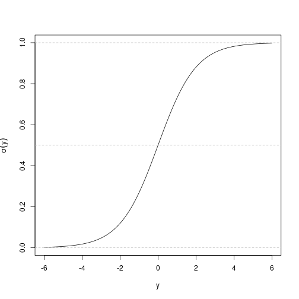

## Case study: the Titanic

The Titanic — a movie, but also an actual ship that hit an actual iceberg and sunk, unfortunately. There were a lot of people aboard; only a fraction survived. There is a dataset of all the people who bought tickets (more or less) with data about them:

- What kind of class ticket it was (first / second / third) — `Pclass`.
- Age.
- Sex.
- Number of siblings and spouses aboard (`SibSp`).
- Number of parents and children (`Parch`).
- The fare they paid.
- And actually the names.

One thing people like to do: can we predict, based on the features, who survived and who did not.


``` r
library(titanic)
library(dplyr)
train <- titanic_train
head(train)
```

```
##   PassengerId Survived Pclass
## 1           1        0      3
## 2           2        1      1
## 3           3        1      3
## 4           4        1      1
## 5           5        0      3
## 6           6        0      3
##                                                  Name    Sex Age SibSp Parch
## 1                             Braund, Mr. Owen Harris   male  22     1     0
## 2 Cumings, Mrs. John Bradley (Florence Briggs Thayer) female  38     1     0
## 3                              Heikkinen, Miss. Laina female  26     0     0
## 4        Futrelle, Mrs. Jacques Heath (Lily May Peel) female  35     1     0
## 5                            Allen, Mr. William Henry   male  35     0     0
## 6                                    Moran, Mr. James   male  NA     0     0
##             Ticket    Fare Cabin Embarked
## 1        A/5 21171  7.2500              S
## 2         PC 17599 71.2833   C85        C
## 3 STON/O2. 3101282  7.9250              S
## 4           113803 53.1000  C123        S
## 5           373450  8.0500              S
## 6           330877  8.4583              Q
```

## The setup: predicting a 0/1 outcome

We are predicting a **categorical variable** — did you die or did you survive. There is no "0.5 kind of survived." We convert (arbitrarily) "died" to 0 and "survived" to 1. You can flip those around, it doesn't matter — those are categories.

If we tried to do plain linear regression here, we'd compute $a_0 + a_1 x_1 + a_2 x_2 + \cdots$, which could be any real number. But what we want is just 0 or 1. So:

- Compute the linear combination $y = a_0 + a_1 x_1 + \cdots$, which is some real number.
- Transform $y$ with a function so that it looks like a probability.

## The sigmoid function

The usual function is:

$$\sigma(y) = \frac{1}{1 + e^{-y}}.$$

This squashes any real $y$ into $(0, 1)$. It is never exactly $0$ and never exactly $1$, but it can be very close. If $y$ is very large, $e^{-y}$ is tiny, so $\sigma(y) \approx 1$. If $y$ is very negative, $e^{-y}$ is huge, so $\sigma(y) \approx 0$. If $y = 0$, $\sigma(y) = 0.5$.


``` r
sigma <- function(y){ 1 / (1 + exp(-y)) }
ys <- seq(-6, 6, by = 0.1)
plot(ys, sigma(ys), type = "l", xlab = "y", ylab = expression(sigma(y)))
abline(h = c(0, 0.5, 1), col = "gray", lty = 2)
```



## Logistic regression in R

The model is:

$$P(\text{survived} = 1) = \sigma(a_0 + a_1 x_1 + a_2 x_2 + \cdots).$$

We use `glm` (generalized linear model) with `family = binomial`:


``` r
fit <- glm(Survived ~ Sex + Age + Pclass, data = train, family = binomial)
fit
```

```
## 
## Call:  glm(formula = Survived ~ Sex + Age + Pclass, family = binomial, 
##     data = train)
## 
## Coefficients:
## (Intercept)      Sexmale          Age       Pclass  
##     5.05601     -2.52213     -0.03693     -1.28855  
## 
## Degrees of Freedom: 713 Total (i.e. Null);  710 Residual
##   (177 observations deleted due to missingness)
## Null Deviance:	    964.5 
## Residual Deviance: 647.3 	AIC: 655.3
```

The interpretation: the probability of survival is

$$\sigma\big(\text{intercept} + a_{\text{sex}=\text{male}}\cdot I_{\text{male}} + a_{\text{age}}\cdot \text{Age} + a_{\text{Pclass}}\cdot \text{Pclass}\big).$$

So you subtract about 2.5 if the person is male (and don't do anything if female); the age coefficient is about $-0.04$; the class coefficient is about $-1.3$.

A thing people say about the Titanic — as in the movie — is that being male lowered your probability of survival. The hypothesis in general was that men let the women survive ("women and children first"). It seems to have been the case on the Titanic. If you look at the larger dataset of shipwrecks at the time, it apparently was *not* the case — it was about 50/50. But the Titanic itself does fit the headline.

You can see that in the formula: subtract 2.5 if you are male. Similarly, third class is bad — subtract $1.3 \times 3 \approx 4$. Age does not seem to matter much.

### `family = binomial`

This tells `glm` that we are doing logistic regression. Technically it specifies a particular cost function. You don't have to remember the term "binomial".

## Logistic regression cost function

For linear regression with squared loss, you can derive it from the Gaussian noise model. For logistic regression you do something similar but the cost function works out to:

$$J(a) = -\sum_i \Big[ y^{(i)} \log \hat y^{(i)} + (1 - y^{(i)}) \log (1 - \hat y^{(i)}) \Big]$$

where $\hat y^{(i)} = \sigma(a^\top x^{(i)})$. This is the **negative log likelihood** (sometimes called cross-entropy). Similar to the linear-regression case, there are two ways to motivate it: a likelihood story (if it is really true that the log-odds are linear in the inputs, this is the maximum-likelihood cost), or just "it's a thing that makes sense — bigger penalty the more confidently wrong you are."

## `predict` with logistic regression


``` r
new_passenger <- data.frame(Sex = "male", Age = 30, Pclass = 1)
predict(fit, newdata = new_passenger, type = "response")
```

```
##         1 
## 0.5343109
```

`type = "response"` gives you the probability. Without it (default), `predict` gives you the linear predictor $a_0 + a_1 x_1 + \cdots$ before the sigmoid.

You can compute the same thing by hand using `plogis` (which is just the sigmoid):


``` r
plogis(coef(fit)["(Intercept)"] +
       coef(fit)["Sexmale"] * 1 +
       coef(fit)["Age"] * 30 +
       coef(fit)["Pclass"] * 1)
```

```
## (Intercept) 
##   0.5343109
```

## Categorical vs continuous Pclass

`Pclass` is 1, 2, or 3 — kind of categorical but kind of numeric. You can argue it either way. With logistic regression on it as-is (numeric), R treats class as one continuous variable with one coefficient.

If you want to treat it as categorical, use `as.factor`:


``` r
fit_factor <- glm(Survived ~ Sex + Age + as.factor(Pclass), data = train, family = binomial)
fit_factor
```

```
## 
## Call:  glm(formula = Survived ~ Sex + Age + as.factor(Pclass), family = binomial, 
##     data = train)
## 
## Coefficients:
##        (Intercept)             Sexmale                 Age  as.factor(Pclass)2  
##            3.77701            -2.52278            -0.03699            -1.30980  
## as.factor(Pclass)3  
##           -2.58063  
## 
## Degrees of Freedom: 713 Total (i.e. Null);  709 Residual
##   (177 observations deleted due to missingness)
## Null Deviance:	    964.5 
## Residual Deviance: 647.3 	AIC: 657.3
```

Now there is a separate coefficient for class 2 and class 3 (class 1 is the dropped category).

You can also convert to a character, which R also treats as categorical:


``` r
train2 <- train
train2$Pclass <- as.character(train2$Pclass)
glm(Survived ~ Sex + Age + Pclass, data = train2, family = binomial)
```

```
## 
## Call:  glm(formula = Survived ~ Sex + Age + Pclass, family = binomial, 
##     data = train2)
## 
## Coefficients:
## (Intercept)      Sexmale          Age      Pclass2      Pclass3  
##     3.77701     -2.52278     -0.03699     -1.30980     -2.58063  
## 
## Degrees of Freedom: 713 Total (i.e. Null);  709 Residual
##   (177 observations deleted due to missingness)
## Null Deviance:	    964.5 
## Residual Deviance: 647.3 	AIC: 657.3
```

Whether you use `as.factor` or `as.character` doesn't matter statistically — it is just that sometimes you see different things.

As it turns out for this data set, the difference between class 1 and class 2 is roughly equal to the difference between class 2 and class 3 — so treating class as continuous gives basically the same predictions as treating it as categorical. (This is the kind of question that can show up on a test: when would treating something categorical-vs-continuous actually matter? Answer: when the category labels are numbered in a way that does not match the underlying effect.)

## Evaluating classification

How do you evaluate a logistic-regression model? You are predicting probabilities. If you actually want to use the model, you probably want a hard 0/1 prediction.

One way: threshold the probability at 0.5.


``` r
train$predicted_prob <- predict(fit, newdata = train, type = "response")
train$prediction <- train$predicted_prob > 0.5
head(train %>% select(Survived, Age, Sex, Pclass, predicted_prob, prediction))
```

```
##   Survived Age    Sex Pclass predicted_prob prediction
## 1        0  22   male      3     0.10487462      FALSE
## 2        1  38 female      1     0.91405306       TRUE
## 3        1  26 female      3     0.55730127       TRUE
## 4        1  35 female      1     0.92236664       TRUE
## 5        0  35   male      3     0.06759234      FALSE
## 6        0  NA   male      3             NA         NA
```

### Classification accuracy

How much of the time does the prediction match the actual answer?


``` r
mean(train$Survived == train$prediction, na.rm = TRUE)
```

```
## [1] 0.7885154
```

About 78%. **Is this good?** You just shrugged — which is an excellent answer, because this number doesn't tell you anything at all.

### The base rate

The number doesn't tell you anything because it depends on what you could have done by just guessing the majority class.


``` r
mean(train$Survived == 0)
```

```
## [1] 0.6161616
```

If you just predict "died" every time, you'd be right about 61% of the time (because most people died). So the 78% is **better** than the base rate — but not by an overwhelming margin. The lesson: you should always check accuracy against the base rate. Without that, accuracy could look impressive just because the base rate is already not 50%.

## False positives, false negatives

Sometimes what you care about is not raw accuracy, but the kinds of errors.

- **False positive rate**: out of all the times the correct answer was "no", how many times did the model say "yes"? Formally: $\text{FP} / (\text{actual N})$. "False positive" means the model said positive, but it was actually negative.
- **False negative rate**: out of all the times the correct answer was "yes", how many times did the model say "no"? Formally: $\text{FN} / (\text{actual P})$.

Compute these manually:


``` r
# Predict positive = predicted survived, actual positive = actually survived
predicted_positive <- train$prediction == TRUE
actual_positive <- train$Survived == 1
predicted_positive_actual_negative <- predicted_positive & !actual_positive
predicted_negative_actual_positive <- !predicted_positive & actual_positive

# False positive rate: out of actual negatives, how many we said positive
sum(predicted_positive_actual_negative, na.rm = TRUE) / sum(!actual_positive, na.rm = TRUE)
```

```
## [1] 0.1238616
```

``` r
# False negative rate: out of actual positives, how many we said negative
sum(predicted_negative_actual_positive, na.rm = TRUE) / sum(actual_positive, na.rm = TRUE)
```

```
## [1] 0.2426901
```

### Why each matters

Imagine you are selling insurance for people going on a cruise. A false positive is incorrectly predicting that they survived. As an insurer, that's bad — you would have to pay out. So you care about **false positives**.

In a hospital, predicting whether a patient is about to deteriorate: if the model says "this patient is fine" when actually they are about to die, that is a **false negative**, and it is the worst kind of error. So you optimize the model with a very low false negative rate, which means a high false positive rate, which means alerts going off all the time, which means doctors and nurses learn to ignore the alerts. (That is the standard situation.) The trade-off is hard.

## Positive predictive value and negative predictive value

There are two more quantities that get used a lot. They are different from FPR/FNR because the denominator is different:

- **PPV (positive predictive value)**: out of the times the model said "positive", how many were correct? $\text{TP} / (\text{TP} + \text{FP})$. Sometimes called precision.
- **NPV (negative predictive value)**: out of the times the model said "negative", how many were correct? $\text{TN} / (\text{TN} + \text{FN})$.

These can be completely different from FPR/FNR. If the model is highly accurate, of course they are similar. But if it is not, they could be completely different numbers, because the denominator (actual positives vs predicted positives) can be very different. For example: out of the times you predict "this patient is going to die", how often is that correct? That is PPV, and it directly tells you how trustworthy a positive alarm is.

Which is positive and which is negative is itself somewhat conventional — the same column could be `Survived` (positive = survived) or `Died` (positive = died) — and the FPR/FNR would swap. There is no actual rule, just stick with one and be consistent.
