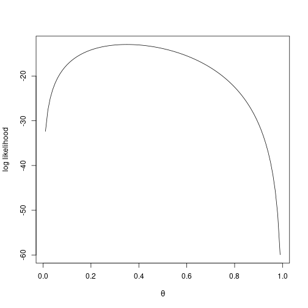
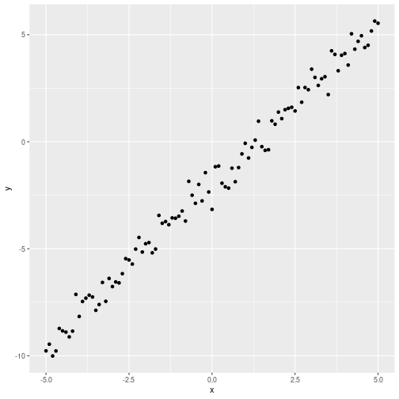

## The setting: coin tosses

Suppose a coin is tossed $n$ times independently. Write

$$y_i \sim \text{Bern}(\theta), \quad i = 1, \ldots, n.$$

This is a fancy way of saying: we have a random variable $y$ which could be $0$ or $1$, and the probability of $1$ is $\theta$, the probability of $0$ is $1-\theta$:

$$P(y_i = 1) = \theta, \qquad P(y_i = 0) = 1 - \theta.$$

We say the trials are **iid** — independently, identically distributed. *Independent* means physically we are tossing the coin separately, the outcomes between trials do not depend on each other; *identically distributed* means the same $\theta$ for every toss.

In our notation, the data we will observe are $y_1, \ldots, y_n$. The uppercase variables ($Y_i$) are random variables — they could be anything. The lowercase variables ($y_i$) are the specific observed values — 0 or 1.

We are given that $P(Y_i = 1) = \theta$, but we do not know $\theta$. **The task of statistical inference is: what is $\theta$?**

The honest answer is, of course, we don't know what $\theta$ is. $\theta$ is a property of the coin; we just have some data, that doesn't tell us what $\theta$ is exactly.

## The intuitive estimate

If $\theta$ is the probability of heads and we toss the coin $n$ times and get heads $k$ times, intuitively $\theta \approx k/n$:

$$\hat{\theta} = \frac{y_1 + y_2 + \cdots + y_n}{n}.$$

The zeros don't count. The ones account for the times the toss came up heads. Of course this is just an estimate — toss the same coin again, get a different estimate. That is how coins work.

How do we say it is an estimate that makes sense mathematically?

## The likelihood function

If we know $\theta$, we wrote down:

- $P(Y_i = 1 \mid \theta) = \theta$
- $P(Y_i = 0 \mid \theta) = 1 - \theta$

You can write this cleverly as:

$$P(Y_i = y_i \mid \theta) = \theta^{y_i}\, (1 - \theta)^{1 - y_i}.$$

This is not saying any more than the two lines above, because one of the exponents is always zero, and anything to the zero is one. So either $\theta^{y_i}$ disappears or $(1-\theta)^{1-y_i}$ disappears.

Now, what is the probability of observing the data we actually observe (i.e., $y_1, y_2, \ldots, y_n$) given $\theta$? Because the trials are independent, it is the product:

$$L(\theta) = P(y_1, y_2, \ldots, y_n \mid \theta) = \prod_{i=1}^{n} \theta^{y_i}\, (1 - \theta)^{1 - y_i}.$$

This is called the **likelihood function**. It is the probability of observing the data that you observed if the parameter (in this case $\theta$) is fixed.

Note that this is not quite conditional probability — $\theta$ is a fixed parameter, not a random variable. People will write it like a conditional probability because that is how the textbooks do it.

## Maximum likelihood

The **maximum likelihood estimate** is the value of $\theta$ that makes the data we observed as likely as possible:

$$\hat{\theta}_{\text{MLE}} = \arg\max_{\theta}\, L(\theta).$$

This is a *choice* we make — there is no law of nature that says the right estimate is the maximum-likelihood one. We are saying: pick the parameter so that the data we actually observe is as likely as possible under that parameter.

### Derivation (calculus)

Let's derive the MLE on paper for the Bernoulli case. With $n$ tosses, $y_1, \ldots, y_n$:

$$L(\theta) = \prod_{i=1}^n \theta^{y_i}(1-\theta)^{1-y_i}.$$

The maximum of $L$ equals the maximum of $\log L$ (the log is monotonic). Furthermore, $\log(ab) = \log a + \log b$, so the product decomposes:

$$\log L(\theta) = \sum_{i=1}^n \big[ y_i \log \theta + (1 - y_i) \log(1 - \theta) \big].$$

Take the derivative and set to zero:

$$\frac{d\,\log L}{d\theta} = \sum_{i=1}^n \left( \frac{y_i}{\theta} - \frac{1 - y_i}{1 - \theta} \right) = 0.$$

Multiply both sides by $\theta(1-\theta)$:

$$\sum_{i=1}^n \left[ y_i (1 - \theta) - (1 - y_i) \theta \right] = 0$$

$$\sum_{i=1}^n y_i - n\theta = 0$$

$$\boxed{\hat\theta_{\text{MLE}} = \frac{1}{n}\sum_{i=1}^n y_i}.$$

So the maximum likelihood estimator is just the sample mean — exactly the intuitive estimate. (This derivation, you can take a picture; it is on every page on the internet ever.)

## MLE in code (without calculus)

We want to do the same thing but with code rather than calculus. This thing you can of course do with calculus, you do not need code. The reason we are doing it in code is:

- Sometimes you want to do maximum likelihood but the model is so complex that calculus just does not work.
- It is going to be useful when we do Bayesian inference, where calculus rarely works.

### Step 1: generate some data

In R, you generate random binomial values with `rbinom`. Bernoulli is the special case `size = 1`:


``` r
set.seed(1)
n <- 20
secret_theta <- 0.3
y <- rbinom(n = n, size = 1, prob = secret_theta)
y
```

```
##  [1] 0 0 0 1 0 1 1 0 0 0 0 0 0 0 1 0 1 1 0 1
```

We of course know that one way to estimate $\theta$ here is just to take the mean of `y`. We want to do it the complicated way.

### Step 2: define the Bernoulli likelihood


``` r
bernoulli_likelihood <- function(y, theta){
  prod(theta^y * (1 - theta)^(1 - y))
}
bernoulli_likelihood(y, 0.2)
```

```
## [1] 7.036874e-07
```

What happens for a single value of $\theta$:


``` r
# Returns one per data point, then we prod them:
likes <- 0.2^y * (1 - 0.2)^(1 - y)
likes
```

```
##  [1] 0.8 0.8 0.8 0.2 0.8 0.2 0.2 0.8 0.8 0.8 0.8 0.8 0.8 0.8 0.2 0.8 0.2 0.2 0.8
## [20] 0.2
```

``` r
prod(likes)
```

```
## [1] 7.036874e-07
```

If you have a larger dataset, the likelihood is going to be so tiny that you get **rounding issues**. So the usual way that people do it is `log` then `sum`:


``` r
bernoulli_log_likelihood <- function(y, theta){
  sum(y * log(theta) + (1 - y) * log(1 - theta))
}
bernoulli_log_likelihood(y, 0.2)
```

```
## [1] -14.16693
```

Equivalently:


``` r
exp(sum(log(0.2^y * (1 - 0.2)^(1 - y))))
```

```
## [1] 7.036874e-07
```

This is the same number as `prod(...)` for small samples but works numerically when the underlying number is very small.

### Step 3: grid search over $\theta$

The really dumb way of doing it — but the one we want to do here — is to try every possible $\theta$ and see which one produces the largest likelihood.


``` r
thetas <- seq(0.01, 0.99, by = 0.01)
log_likes <- sapply(thetas, function(t) bernoulli_log_likelihood(y, t))

plot(thetas, log_likes, type = "l",
     xlab = expression(theta), ylab = "log likelihood")
```



The MLE is the $\theta$ that corresponds to the maximum:


``` r
thetas[which.max(log_likes)]
```

```
## [1] 0.35
```

It is not going to be exactly the same number every time, but it is going to be close to the true `secret_theta = 0.3`. If we redo it with more data:


``` r
n_big <- 2000
y_big <- rbinom(n = n_big, size = 1, prob = secret_theta)
log_likes_big <- sapply(thetas, function(t) bernoulli_log_likelihood(y_big, t))
thetas[which.max(log_likes_big)]
```

```
## [1] 0.3
```

That is close to 0.3 every time.

This gives you a glimpse of what is behind confidence intervals — if you run this procedure multiple times, what is the spread of estimates? Ordinarily in introductory statistics you are taught exactly that: the spread around the maximum-likelihood estimate.

### Boundary

A small detail: at $\theta = 1$, the likelihood is not defined when there is any zero in `y`, because $\log 0 = -\infty$. So set the grid to go up to 0.999 rather than literal 1:


``` r
thetas <- seq(0.001, 0.999, by = 0.001)
```

## Maximum likelihood for linear regression

The standard linear regression model is:

$$y_i = \theta^\top x_i + \varepsilon_i, \qquad \varepsilon_i \sim N(0, \sigma^2).$$

Here, $x_i$ are fixed, $\theta$ are coefficients (we do not know them), and $y_i$ are measured. $\theta^\top x_i$ just means the dot product between $\theta$ and $x_i$: $\theta_0 x_0 + \theta_1 x_1 + \cdots$ (the constant term is $\theta_0$ multiplied by a $1$ in the first coordinate of $x_i$).

The slack between the prediction $\theta^\top x_i$ and the measured $y_i$ is the noise $\varepsilon_i$, which we model as normal with variance $\sigma^2$. The way we interpret it in the maximum-likelihood framework is:

- The $x$'s are given.
- The $\theta$'s are unknown.
- The $y$'s are measured.
- In the same way that we toss a coin and generate heads or tails, here we generate a $y$ by computing $\theta^\top x$ and adding a random $\varepsilon$. That's our model of how the data came about.

### The likelihood

The likelihood of one point is the density of the Gaussian at $y_i - \theta^\top x_i$:

$$p(y_i \mid \theta, x_i) = \frac{1}{\sqrt{2\pi\sigma^2}}\, \exp\!\left( - \frac{(y_i - \theta^\top x_i)^2}{2\sigma^2} \right).$$

This is largest when the residual $\varepsilon_i = y_i - \theta^\top x_i$ is zero.

The likelihood of the whole dataset is the product (by independence):

$$L(\theta) = \prod_{i=1}^n p(y_i \mid \theta, x_i).$$

### From likelihood to least squares

Take the log:

$$\log L(\theta) = \text{const} - \frac{1}{2\sigma^2}\sum_{i=1}^n (y_i - \theta^\top x_i)^2.$$

Maximizing $\log L$ over $\theta$ is the same as **minimizing the sum of squared residuals**:

$$\hat\theta_{\text{MLE}} = \arg\min_\theta \sum_{i=1}^n (y_i - \theta^\top x_i)^2.$$

So the maximum-likelihood line is the same as the **ordinary least-squares (OLS) line** under this Gaussian-noise model.

### Doing it in code

Let's generate some data and visualize:


``` r
x <- seq(-5, 5, by = 0.1)
y <- -2 + 1.5 * x + rnorm(length(x), mean = 0, sd = 0.5)
df <- data.frame(x = x, y = y)

library(ggplot2)
ggplot(df, aes(x = x, y = y)) + geom_point()
```



We want to find the maximum-likelihood line. The parameters are $\theta_0$ (intercept) and $\theta_1$ (slope). We can also estimate $\sigma$ from the data, but for maximum likelihood it does not matter what we assume $\sigma$ to be — it all comes out the same anyway.

We could use the built-in `dnorm`, or use the formula directly. If we take the log, we get a constant plus $-(y - \theta_0 - \theta_1 x)^2 / (2 \sigma^2)$, and the constant does not matter for the maximum.


``` r
sigma <- 0.5

point_log_likelihood <- function(y_obs, x_obs, theta0, theta1, sigma){
  -(y_obs - theta0 - theta1 * x_obs)^2 / (2 * sigma^2)
}

total_log_likelihood <- function(df, theta0, theta1, sigma){
  sum(point_log_likelihood(df$y, df$x, theta0, theta1, sigma))
}

# Grid search:
theta0_grid <- seq(-3, -1, by = 0.05)
theta1_grid <- seq(1, 2, by = 0.05)
best <- c(NA, NA, -Inf)
for(t0 in theta0_grid){
  for(t1 in theta1_grid){
    ll <- total_log_likelihood(df, t0, t1, sigma)
    if(ll > best[3]) best <- c(t0, t1, ll)
  }
}
best
```

```
## [1]  -2.00000   1.50000 -49.17282
```

The estimated `(theta0, theta1)` should be close to `(-2, 1.5)`. That is what we generated the data with. The same thing falls out from `lm(y ~ x)`, which uses the OLS formula directly.

It is kind of nice that least-squares also turns out to be the maximum-likelihood estimate under the Gaussian noise model.
