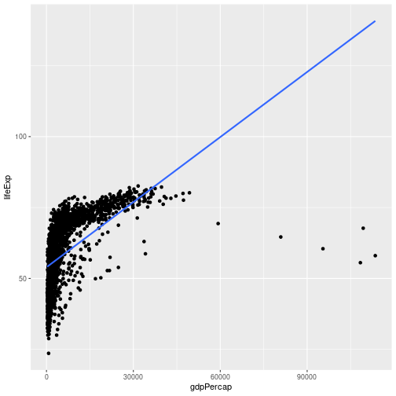
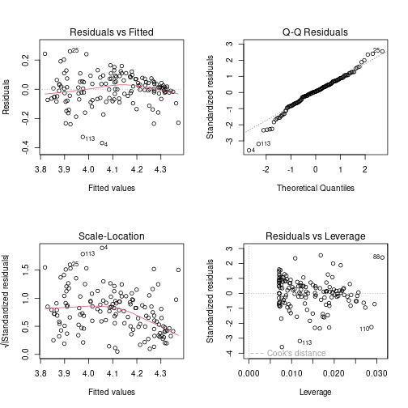

This is about: when can you trust the p-values that `summary(lm(...))` gives you? When the assumptions hold. When do they hold? Let's see.

## Refresher: linear regression

We have inputs $x^{(i)}$ and outputs $y^{(i)}$. The prediction is $\hat y^{(i)} = a_0 + a_1 x_1^{(i)} + \cdots + a_n x_n^{(i)}$. The **residual** is the difference between the correct answer and the estimated answer:

$$r^{(i)} = y^{(i)} - \hat y^{(i)}.$$

We minimize the sum of squared residuals — that is the cost function for linear regression. Ordinarily $y$ is continuous (logistic was the special case for binary $y$).

For inference, the null hypothesis is usually of the form $a_j = 0$ for some $j$. The test: read off the p-value from `summary(lm(...))`.

The problem is that **just reading off the p-value is really bad practice**, because the p-value can be large or small for reasons not directly related to whether your actual hypothesis is true or false.

## The assumptions

If the assumptions are wrong, the p-value is *still computed* by the formula — but the number doesn't mean anything.

1. **Linearity.** The expectation $E[y \mid x]$ is linear in $x$. If the relationship is not actually linear, the p-values mean nothing. Sometimes you can fix this by transforming variables (e.g., take the log of GDP per capita).
2. **Residuals normally distributed around zero.** The "noise" term in the regression model is $N(0, \sigma^2)$, so the residuals — if your model is right — should look approximately normal.
3. **Residuals independent.** If the residuals for nearby $x$ values cluster (positive, positive, negative, negative, positive, positive...), they are not independent, which also breaks the p-value interpretation.

## Spotting non-linearity by eye

We saw gapminder before. If you regress life expectancy on raw GDP per capita, the picture is wrong:


``` r
library(gapminder)
library(ggplot2)
library(dplyr)

ggplot(gapminder, aes(x = gdpPercap, y = lifeExp)) +
  geom_point() +
  geom_smooth(method = "lm", se = FALSE)
```



It is not even a straight line. So we definitely cannot run linear regression on it as-is. We transform: regress life expectancy on `log(GDP per capita)`. That works.

If you don't fix this, the p-value will be computed by the formula, but it just doesn't mean anything.

### Sketching the issue with residuals

If you have a curve through the data that is fitting a straight line to a U-shape, all the residuals are going to be systematically positive or systematically negative for different ranges. That is "not normally distributed around zero" and "not independent" all at once.

## Diagnostic plots

When you call `plot(lm_fit)`, R gives you four diagnostic plots. Let's run them.


``` r
gap_1982 <- gapminder %>% filter(year == 1982)
model <- lm(log(lifeExp) ~ log(gdpPercap), data = gap_1982)

par(mfrow = c(2, 2))
plot(model)
```



``` r
par(mfrow = c(1, 1))
```

### 1. Residuals vs Fitted

This plots the residuals against the fitted values $\hat y$.

What you expect when the model is correct: a fuzzy cloud around 0 with no systematic pattern — for some fitted values residuals are positive, for some negative, and the amounts are comparable.

What goes wrong: if residuals systematically clump (e.g., all positive for small $\hat y$, all negative for medium $\hat y$, all positive again for large $\hat y$), that indicates non-linearity, non-independence, or both.

### 2. Q–Q plot of residuals

Q–Q stands for quantile–quantile. You take all the observations (here, residuals) and compare them to a normal distribution. If the residuals are perfectly normal, the points should lie on a straight line. Deviations from the line indicate heavier-than-normal tails or outliers.

In the gapminder fit, you typically see the tails go further than what you would expect from a perfectly normal distribution — there are some outliers on the left and some on the right. Most of the points are on the line; it is fine.

### 3. Scale-Location

This plots the square root of the standardized residuals against the fitted values. Ideally this is a flat horizontal cloud — the variance of residuals is the same regardless of fitted value.

If the cloud grows with the fitted value, the variance is not constant — your assumption is violated. The residuals are larger in absolute terms when the prediction is larger.

Why might that happen? Imagine your error is **multiplicative** rather than **additive**: if life expectancy is 50, you might be off by ±5; if life expectancy is 70, you might be off by ±7. That is "plus or minus a percent" rather than "plus or minus a constant." If you see Scale-Location growing with fitted value, that is an argument for predicting `log(y)` instead of `y` — because $\log(0.9 y) = \log y + \log 0.9$, which makes multiplicative on the original scale into *additive* on the log scale.

### 4. Residuals vs Leverage

Tells you which observations have a lot of *influence* on the fit. Standardized residuals on one axis, leverage on the other. Mostly a sanity check; lets you spot specific high-influence outliers.

## Outliers

You can look up the row numbers of the most extreme residuals:


``` r
worst <- order(abs(residuals(model)), decreasing = TRUE)[1:5]
gap_1982[worst, ]
```

```
## # A tibble: 5 × 6
##   country      continent  year lifeExp        pop gdpPercap
##   <fct>        <fct>     <int>   <dbl>      <int>     <dbl>
## 1 Angola       Africa     1982    39.9    7016384     2757.
## 2 Sierra Leone Africa     1982    38.4    3464522     1465.
## 3 China        Asia       1982    65.5 1000281000      962.
## 4 Myanmar      Asia       1982    58.1   34680442      424 
## 5 Sri Lanka    Asia       1982    68.8   15410151     1648.
```

Doing this on `gap_1982`, the most extreme outliers tend to be resource-export economies (Sierra Leone, Angola, Gabon — diamonds, oil, etc.).

The issue: if you are a resource-intensive economy, your GDP per capita might be kind of high, but this is all resource exports — so this GDP per capita doesn't really influence life expectancy the way you would expect. There are several extremely rich countries today that are mostly rich because of resource exports; their life expectancy is good, but not in proportion to how rich they are.

### Should you throw out the outliers?

Here, **I would not**. If you start throwing out data points because "oh, they have too much diamonds, so they don't count" — well, you end up throwing out lots of countries because there are special circumstances always. The relationship you are interested in is between life expectancy and GDP per capita. If you start making exceptions, that is more an argument that maybe GDP per capita is not what you care about — maybe you care about GDP per capita not including resource extraction. But that's an argument about what you want to measure, not about how to construct a data frame.

A subjective call, depending on the question. If the question is the general relationship between GDP per capita and life expectancy, leave them in. If the question is specifically about how the resource economies behave, separate them out with another input variable.

## After diagnostics: read the summary

Once you are satisfied the model is approximately correct, you can interpret the table. Let's add the categorical variable `continent`:


``` r
model2 <- lm(log(lifeExp) ~ log(gdpPercap) + continent, data = gap_1982)
summary(model2)
```

```
## 
## Call:
## lm(formula = log(lifeExp) ~ log(gdpPercap) + continent, data = gap_1982)
## 
## Residuals:
##      Min       1Q   Median       3Q      Max 
## -0.32013 -0.03726  0.00159  0.05155  0.23043 
## 
## Coefficients:
##                   Estimate Std. Error t value Pr(>|t|)    
## (Intercept)       3.258174   0.066364  49.096  < 2e-16 ***
## log(gdpPercap)    0.091712   0.008847  10.366  < 2e-16 ***
## continentAmericas 0.128518   0.025350   5.070 1.28e-06 ***
## continentAsia     0.115691   0.021698   5.332 3.94e-07 ***
## continentEurope   0.153334   0.028489   5.382 3.13e-07 ***
## continentOceania  0.148506   0.069386   2.140   0.0341 *  
## ---
## Signif. codes:  0 '***' 0.001 '**' 0.01 '*' 0.05 '.' 0.1 ' ' 1
## 
## Residual standard error: 0.09141 on 136 degrees of freedom
## Multiple R-squared:  0.7645,	Adjusted R-squared:  0.7559 
## F-statistic: 88.32 on 5 and 136 DF,  p-value: < 2.2e-16
```

`log(gdpPercap)` is definitely positively associated with life expectancy — positive coefficient, very small p-value.

For the continents, the table shows one row per continent (with one dropped as the baseline). Each row gets a coefficient with its own p-value.

For example, the Asia coefficient is around $+0.07$ with an SE around $0.03$ — about $2.5 \cdot 0.03 \approx 0.075$ — so the 95% CI is roughly $[0, 0.15]$. Plus a small p-value. The interpretation: "when you're estimating the life expectancy for a country in Asia, you add about 0.07 (on log scale) — that is definitely not zero." So the prediction for Asia is definitely different from the prediction for the baseline (Africa).

## The multiple-comparisons problem in regression

In general, if you read off multiple p-values, one of them is going to be small **just by chance**. That is the multiple-comparisons problem.

What you would do if you are really rigorous: **pre-decide** on the specific question. For example, "in a given year, is the life expectancy in Asia higher than the life expectancy in Africa?" Then run the regression and look at *that one* coefficient. If its p-value is < 5%, reject the null. That is pre-registration.

What people often actually do: look at all the coefficients and report whichever is small. If you look at $k$ coefficients, even if everything is null, you'd expect $0.05k$ of them to be "significant" by chance. So unless your sample is very small, almost something is going to come out "significant".

## The F-test

There is a single test that asks: are *all* the coefficients zero?

The `summary(lm(...))` output reports an **F-statistic** at the bottom along with a p-value. If that p-value is small, you reject the joint null "all coefficients are zero" — at least one of them is non-zero.

In R you can also compare two nested models:


``` r
small <- lm(log(lifeExp) ~ log(gdpPercap), data = gap_1982)
big   <- lm(log(lifeExp) ~ log(gdpPercap) + continent, data = gap_1982)
anova(small, big)
```

```
## Analysis of Variance Table
## 
## Model 1: log(lifeExp) ~ log(gdpPercap)
## Model 2: log(lifeExp) ~ log(gdpPercap) + continent
##   Res.Df    RSS Df Sum of Sq      F    Pr(>F)    
## 1    140 1.4848                                  
## 2    136 1.1365  4   0.34832 10.421 2.158e-07 ***
## ---
## Signif. codes:  0 '***' 0.001 '**' 0.01 '*' 0.05 '.' 0.1 ' ' 1
```

If that p-value is small, the continents add real explanatory power on top of `log(gdpPercap)`.

A common workflow: predecide that you will look at the F-test first. If the F-test rejects the joint null, then you have license to find a specific coefficient that is non-zero. Otherwise you are not allowed to claim any of them are.
