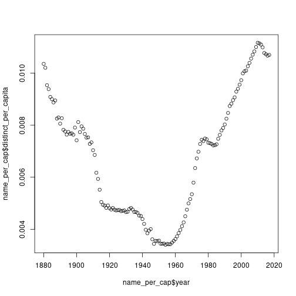

## Function composition

Before we get to `tidyverse`, we just want to think about function composition for a moment. This is the kind of thing that everyone knows already, but we are thinking about it just for the sake of getting into the rhythm.

If `f(x) = x^2` and `g(y) = y + 1`, then in math:

$$f(g(5)) = (5+1)^2 = 36$$

In R:


``` r
f <- function(x){ x ** 2 }
g <- function(y){ y + 1 }
f(g(5))
```

```
## [1] 36
```

## The pipe operator

In R there is a shorthand for function composition called the **pipe operator** `%>%`. The expression `5 %>% g() %>% f()` means "take 5, plug it into `g`, then plug the result into `f`":


``` r
5 %>% g() %>% f()
```

```
## [1] 36
```

One downside is that the pipe is annoying to type. In RStudio (with the R extension installed), **Ctrl+Shift+M** produces the pipe. The arrow `<-` is **Alt+-**.

The reason this is useful is that it is a good way to think about data frames.


``` r
square <- function(y){ y ** 2 }
5 %>% g() %>% square()
```

```
## [1] 36
```

## `tidyverse` and `dplyr` verbs

Let's load `tidyverse` and the `babynames` data set:


``` r
library(dplyr)
library(ggplot2)
library(tidyr)
library(babynames)
```

### `filter` for rows

`filter` selects rows. The following are all equivalent — different ways of selecting rows for which the year is 1880 and the sex is `"F"`:


``` r
filter(babynames, year == 1880, sex == "F")
idx <- (babynames$year == 1880) & (babynames$sex == "F")
babynames[idx, ]
babynames %>% filter(year == 1880 & sex == "F")
babynames %>% filter(year == 1880, sex == "F")
```

The pipe form reads nicest. Technically it is just calling the function `filter`; it is just more convenient to write this way. `filter` can take several conditions joined with commas (equivalent to `&`).

### `select` for columns

`select` produces a new data frame with the specified columns (in the order you specify):


``` r
babynames %>% select(year, name) %>% head()
```

```
## # A tibble: 6 × 2
##    year name     
##   <dbl> <chr>    
## 1  1880 Mary     
## 2  1880 Anna     
## 3  1880 Emma     
## 4  1880 Elizabeth
## 5  1880 Minnie   
## 6  1880 Margaret
```

It is kind of "filter for columns" — get a new data frame with just those specific columns.

### `arrange` for sorting

`arrange` produces a data frame sorted by the column(s) you specify. `babynames` happens to be sorted by year already:


``` r
babynames %>% arrange(n) %>% head()
```

```
## # A tibble: 6 × 5
##    year sex   name          n      prop
##   <dbl> <chr> <chr>     <int>     <dbl>
## 1  1880 F     Adelle        5 0.0000512
## 2  1880 F     Adina         5 0.0000512
## 3  1880 F     Adrienne      5 0.0000512
## 4  1880 F     Albertine     5 0.0000512
## 5  1880 F     Alys          5 0.0000512
## 6  1880 F     Ana           5 0.0000512
```

This is sorted in increasing order, so it shows the rarest entries. To sort in descending order, which is the more interesting thing because you want the most common ones:


``` r
babynames %>% arrange(desc(n)) %>% head()
```

```
## # A tibble: 6 × 5
##    year sex   name        n   prop
##   <dbl> <chr> <chr>   <int>  <dbl>
## 1  1947 F     Linda   99686 0.0548
## 2  1948 F     Linda   96209 0.0552
## 3  1947 M     James   94756 0.0510
## 4  1957 M     Michael 92695 0.0424
## 5  1947 M     Robert  91642 0.0493
## 6  1949 F     Linda   91016 0.0518
```

You can combine with `filter`:


``` r
babynames %>% filter(year == 2000) %>% arrange(desc(n)) %>% head(10)
```

```
## # A tibble: 10 × 5
##     year sex   name            n   prop
##    <dbl> <chr> <chr>       <int>  <dbl>
##  1  2000 M     Jacob       34471 0.0165
##  2  2000 M     Michael     32035 0.0153
##  3  2000 M     Matthew     28572 0.0137
##  4  2000 M     Joshua      27538 0.0132
##  5  2000 F     Emily       25953 0.0130
##  6  2000 M     Christopher 24931 0.0119
##  7  2000 M     Nicholas    24652 0.0118
##  8  2000 M     Andrew      23639 0.0113
##  9  2000 F     Hannah      23080 0.0116
## 10  2000 M     Joseph      22825 0.0109
```

If you want the top 10 female names in 2000:


``` r
babynames %>% filter(year == 2000, sex == "F") %>% arrange(desc(n)) %>% head(10)
```

```
## # A tibble: 10 × 5
##     year sex   name          n    prop
##    <dbl> <chr> <chr>     <int>   <dbl>
##  1  2000 F     Emily     25953 0.0130 
##  2  2000 F     Hannah    23080 0.0116 
##  3  2000 F     Madison   19967 0.0100 
##  4  2000 F     Ashley    17997 0.00902
##  5  2000 F     Sarah     17697 0.00887
##  6  2000 F     Alexis    17629 0.00884
##  7  2000 F     Samantha  17266 0.00866
##  8  2000 F     Jessica   15709 0.00787
##  9  2000 F     Elizabeth 15094 0.00757
## 10  2000 F     Taylor    15078 0.00756
```

You can arrange by multiple columns: `arrange(year, name)` sorts by year, then within each year by name.

### `rename`


``` r
babynames %>% rename(number = n) %>% head()
```

```
## # A tibble: 6 × 5
##    year sex   name      number   prop
##   <dbl> <chr> <chr>      <int>  <dbl>
## 1  1880 F     Mary        7065 0.0724
## 2  1880 F     Anna        2604 0.0267
## 3  1880 F     Emma        2003 0.0205
## 4  1880 F     Elizabeth   1939 0.0199
## 5  1880 F     Minnie      1746 0.0179
## 6  1880 F     Margaret    1578 0.0162
```

This is sometimes useful because `n` is also a function (we will see that in a second).

### `select` with renaming

You can rename as you select. This gives you a data frame with `year`, `sex`, and `number` instead of `n`:


``` r
babynames %>% select(year, sex, number = n) %>% head()
```

```
## # A tibble: 6 × 3
##    year sex   number
##   <dbl> <chr>  <int>
## 1  1880 F       7065
## 2  1880 F       2604
## 3  1880 F       2003
## 4  1880 F       1939
## 5  1880 F       1746
## 6  1880 F       1578
```

This is equivalent to:


``` r
babynames %>% rename(number = n) %>% select(year, sex, number)
```

### `mutate` for adding a column

`mutate` adds one more column; the column can be whatever you want.

The way `babynames` works, you have `n` (count) and `prop` (proportion). So 7% of female babies, say, are named Mary. If you want to reconstruct the population, you can divide `n` by `prop`:


``` r
babynames %>% mutate(total_by_year = round(n / prop)) %>% head()
```

```
## # A tibble: 6 × 6
##    year sex   name          n   prop total_by_year
##   <dbl> <chr> <chr>     <int>  <dbl>         <dbl>
## 1  1880 F     Mary       7065 0.0724         97605
## 2  1880 F     Anna       2604 0.0267         97605
## 3  1880 F     Emma       2003 0.0205         97605
## 4  1880 F     Elizabeth  1939 0.0199         97605
## 5  1880 F     Minnie     1746 0.0179         97605
## 6  1880 F     Margaret   1578 0.0162         97605
```

In the first 10 rows, `total_by_year` is all the same — that's because they are all 1880, and the number of Marys divided by the proportion of Marys equals the number of Janes divided by the proportion of Janes, etc.

### `summarize`

`summarize` creates a new data frame where there is a new column (you can have several), and the column is a function of the columns of the original data frame:


``` r
babynames %>% summarize(mean_n = mean(n))
```

```
## # A tibble: 1 × 1
##   mean_n
##    <dbl>
## 1   181.
```

So this took the column `n` and computed the mean of it. `mean` is just a function like any other; you plug in a vector and get the mean.

By itself this is not that useful, but it becomes useful when you can **group**:


``` r
babynames %>% group_by(sex) %>% summarize(mean_n = mean(n))
```

```
## # A tibble: 2 × 2
##   sex   mean_n
##   <chr>  <dbl>
## 1 F       151.
## 2 M       223.
```

This separates the data frame out by the different sexes and computes the mean of `n` for each. So this is the mean number of babies born per name, by sex. As it happens, in the US data set, there are more babies per name that are male than female — there is basically more diversity in female names. It's approximately the same number of male and female babies; it's just that there are fewer male names. So more babies per name as it turns out.

### `distinct`

`distinct` is kind of similar to `unique` except it operates by row. It says: get me all the rows that are different.

Let's reconstruct the per-year total population:


``` r
b_tot <- babynames %>% mutate(total = round(n / prop))
b_tot %>% head()
```

```
## # A tibble: 6 × 6
##    year sex   name          n   prop total
##   <dbl> <chr> <chr>     <int>  <dbl> <dbl>
## 1  1880 F     Mary       7065 0.0724 97605
## 2  1880 F     Anna       2604 0.0267 97605
## 3  1880 F     Emma       2003 0.0205 97605
## 4  1880 F     Elizabeth  1939 0.0199 97605
## 5  1880 F     Minnie     1746 0.0179 97605
## 6  1880 F     Margaret   1578 0.0162 97605
```

All the rows here are unique because the (year, name) combinations are unique. But if we drop the `name`, `n`, and `prop` columns, lots of rows become the same — because it's just (year, sex, total).


``` r
b_tot %>% select(year, sex, total) %>% distinct() %>% head()
```

```
## # A tibble: 6 × 3
##    year sex   total
##   <dbl> <chr> <dbl>
## 1  1880 F     97605
## 2  1880 F     97604
## 3  1880 F     97606
## 4  1880 F     97603
## 5  1880 F     97607
## 6  1880 F     97602
```

So `distinct` is like `unique` but for rows. (The numbers are not quite equal across names within a year, just because of rounding.)

You can also do `distinct(year)` to get all the different years:


``` r
babynames %>% distinct(year) %>% head()
```

```
## # A tibble: 6 × 1
##    year
##   <dbl>
## 1  1880
## 2  1881
## 3  1882
## 4  1883
## 5  1884
## 6  1885
```

`distinct(year, name)` gets all distinct (year, name) combinations.

### `summarize` with multiple columns


``` r
babynames %>% summarize(mean_n = mean(n), median_n = median(n))
```

```
## # A tibble: 1 × 2
##   mean_n median_n
##    <dbl>    <int>
## 1   181.       12
```

`group_by` followed by `mutate` lets you do per-group proportions:


``` r
babynames %>% group_by(year, sex) %>%
  summarize(total = sum(n)) %>%
  head()
```

```
## # A tibble: 6 × 3
## # Groups:   year [3]
##    year sex    total
##   <dbl> <chr>  <int>
## 1  1880 F      90993
## 2  1880 M     110491
## 3  1881 F      91953
## 4  1881 M     100743
## 5  1882 F     107847
## 6  1882 M     113686
```

### `n_distinct` and the `n` function

`n_distinct(...)` is the number of distinct rows in a data frame (recall that for vectors we could use `length(unique(v))`).

Here we count the number of distinct names for each sex × year:


``` r
babynames %>% group_by(sex, year) %>%
  summarize(distinct_names = n_distinct(name)) %>%
  head()
```

```
## # A tibble: 6 × 3
## # Groups:   sex [1]
##   sex    year distinct_names
##   <chr> <dbl>          <int>
## 1 F      1880            942
## 2 F      1881            938
## 3 F      1882           1028
## 4 F      1883           1054
## 5 F      1884           1172
## 6 F      1885           1197
```

The `n()` function can be used inside `summarize`, `mutate`, and `filter`. Its job is to count the number of rows in each group:


``` r
babynames %>% rename(num = n) %>% summarize(total_entries = n())
```

```
## # A tibble: 1 × 1
##   total_entries
##           <int>
## 1       1924665
```

(Not quite the same as all the name-year combinations: `babynames %>% summarize(name_year_count = n_distinct(year, name))`.)

### `which.max`

`which.max(c(10, 20, 3, 10))` returns the **location** (index) of the maximum.


``` r
which.max(c(10, 20, 3, 10))
```

```
## [1] 2
```

What is the most popular name every year, by sex?


``` r
babynames %>% group_by(year, sex) %>%
  summarize(most_popular_name = name[which.max(n)]) %>%
  head()
```

```
## # A tibble: 6 × 3
## # Groups:   year [3]
##    year sex   most_popular_name
##   <dbl> <chr> <chr>            
## 1  1880 F     Mary             
## 2  1880 M     John             
## 3  1881 F     Mary             
## 4  1881 M     John             
## 5  1882 F     Mary             
## 6  1882 M     John
```

It is John in 1880 for M; over the years it changes. With `group_by`, the table gets split per year × sex, and we ask `name[which.max(n)]` for each group.

### Worked example: distinct names per capita

We compute the number of distinct names per capita, every year, for `sex == "F"`:


``` r
name_per_cap <- babynames %>% filter(sex == "F") %>%
  group_by(year) %>%
  summarize(distinct_names = n_distinct(name),
            total_by_year = sum(n)) %>%
  mutate(distinct_per_capita = distinct_names / total_by_year) %>%
  select(year, distinct_per_capita)

plot(name_per_cap$year, name_per_cap$distinct_per_capita)
```



Let's read this together. `group_by(year)` means one row per year. `filter(sex == "F")` means we are just within F rows. We compute two columns: `distinct_names` is the number of distinct names within the (year) data frame, and `total_by_year` is the sum of `n`. Now we are inside this guy: we want `distinct_per_capita`, which is `distinct_names / total_by_year`. This is a `mutate` because we are adding another column, not grouping. Then we just keep `year` and `distinct_per_capita`.

There were fewer names in 1950 — everyone had the same name. Things got more diverse recently.

To do it for both M and F at the same time, just add `sex` to the group:


``` r
name_per_cap_2 <- babynames %>%
  group_by(year, sex) %>%
  summarize(distinct_names = n_distinct(name),
            total_by_year = sum(n)) %>%
  mutate(distinct_per_capita = distinct_names / total_by_year) %>%
  select(year, sex, distinct_per_capita)
head(name_per_cap_2)
```

```
## # A tibble: 6 × 3
## # Groups:   year [3]
##    year sex   distinct_per_capita
##   <dbl> <chr>               <dbl>
## 1  1880 F                 0.0104 
## 2  1880 M                 0.00958
## 3  1881 F                 0.0102 
## 4  1881 M                 0.00990
## 5  1882 F                 0.00953
## 6  1882 M                 0.00967
```

### Should we compute names per capita or total names?

There are arguments either way.

- **Why compute the total number of names?** We are interested in how diverse the names are in the US. In some sense the population is irrelevant — if there are 50,000 names available to choose from, that's interesting regardless of the fact that the population is very large. It is a question of how people are naming, not how many people there are.
- **Why compute the number of names per capita?** If there are only 1,000 babies born, there cannot be more than 1,000 unique names. If there are 1,000 newborns and each of them has a unique name, that indicates that the names are very diverse.
- **Maybe we should do neither?** Perhaps a compromise would be to compute the number of unique names per cultural or linguistic group — but that is difficult to define. If the population is larger you would expect more cultural groups just because a smaller population cannot support many distinct cultural groups; if you want an overall trend you'd actually need to separate out by cultural groups, average per cultural group, then aggregate.

## `gapminder` mini-tour

The `gapminder` data set is a dataset of countries with life expectancy, population, GDP per capita for different years:


``` r
library(gapminder)
head(gapminder)
```

```
## # A tibble: 6 × 6
##   country     continent  year lifeExp      pop gdpPercap
##   <fct>       <fct>     <int>   <dbl>    <int>     <dbl>
## 1 Afghanistan Asia       1952    28.8  8425333      779.
## 2 Afghanistan Asia       1957    30.3  9240934      821.
## 3 Afghanistan Asia       1962    32.0 10267083      853.
## 4 Afghanistan Asia       1967    34.0 11537966      836.
## 5 Afghanistan Asia       1972    36.1 13079460      740.
## 6 Afghanistan Asia       1977    38.4 14880372      786.
```

### How many countries on a given continent

One way: filter, get the countries, unique them, take the length.


``` r
asia <- gapminder %>% filter(continent == "Asia")
length(unique(asia$country))
```

```
## [1] 33
```

A more idiomatic way:


``` r
gapminder %>% filter(continent == "Asia") %>%
  select(country) %>%
  distinct() %>%
  count()
```

```
## # A tibble: 1 × 1
##       n
##   <int>
## 1    33
```

### Country with largest life expectancy on a continent between years `y1` and `y2`


``` r
top_country <- function(continent_name, y1, y2){
  g1 <- gapminder %>%
    filter(continent == continent_name,
           year >= y1,
           year <= y2)
  g1$country[g1$lifeExp == max(g1$lifeExp)]
}
top_country("Asia", 1970, 1980)
```

```
## [1] Japan
## 142 Levels: Afghanistan Albania Algeria Angola Argentina Australia ... Zimbabwe
```

Note the `>=` and `<=`: gapminder samples years every five years (1952, 1957, …, 2007), so strict inequalities `year > 1970` and `year < 1980` would catch *no* rows at all (nothing in the data is strictly between 1970 and 1980). It's a common gotcha with this dataset.

### World population in a given year

We want the sum of all populations, by year. With `group_by(year)` and `summarize(sum(pop))`:


``` r
world_pop <- gapminder %>% group_by(year) %>% summarize(total = sum(pop))
world_pop %>% filter(year == 1982)
```

```
## # A tibble: 1 × 2
##    year      total
##   <int>      <dbl>
## 1  1982 4289436840
```

``` r
world_pop %>% filter(year == 2007)
```

```
## # A tibble: 1 × 2
##    year      total
##   <int>      <dbl>
## 1  2007 6251013179
```

4.3 billion in 1982 and 6.2 billion in 2007 — that sounds about right.

## `sapply` and vector-safe functions

If what you have is a function that is just `x^2`, you can apply it to a vector directly — it just works:


``` r
square <- function(x){ x ** 2 }
vec <- c(1, 2, 4, 5)
square(vec)
```

```
## [1]  1  4 16 25
```

This only works for algebraic expressions. If you have something like:


``` r
special.square <- function(x){
  if(x == 42){
    42
  } else {
    x ** 2
  }
}
```

then `special.square(vec)` produces an error, because `if(c(F, F, F, F))` does not make sense — there has to be one logical value inside the `if`.

If what you want is to apply `special.square` to every element of `vec`, use `sapply`:


``` r
vec <- c(1, 2, 42, 5)
sapply(X = vec, FUN = special.square)
```

```
## [1]  1  4 42 25
```

`sapply` applies the function specified by `FUN` to every element of the vector after `X`. (`FUN` is short for "function", not "fun"; though it kind of is fun.)

You can also call without named arguments — `sapply(vec, special.square)` — but using named arguments makes things clear.

Nothing conceptually complicated here. It is just `for`-loop logic re-expressed as a function call. R does have `for` loops as well; it is just that in the style we are working in, you can also do `sapply`. R also happens to run `sapply` faster than the equivalent `for` loop.

### `sapply` with extra arguments

Suppose we want to compute `elem - 2` for every element `elem` in a vector using the function `minus`:


``` r
minus <- function(a, b){ a - b }
vec <- c(5, -6, 7, -8)
sapply(X = vec, FUN = minus, b = 2)
```

```
## [1]   3  -8   5 -10
```

We can specify that the `2` is sent into `b`. Note that `X = vec` is special: that will be the first argument given to `minus`, i.e. every element of `X = vec` will be sent to `a`.
