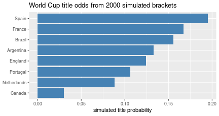

## Breiman's two cultures

Leo Breiman — a Berkeley statistician — wrote a famous 2001 essay, *"Statistical
Modeling: The Two Cultures,"* telling the story of his own move from one half of
this course to the other. He identifies two ways to analyze data:

- **The data-modeling culture.** Assume a **model of how the data was generated**
  — a mechanism, a causal structure — fit it, and draw conclusions *about the
  world* from it. This is the first half of the course: probability models,
  maximum likelihood, Bayesian inference, hypothesis testing, causal inference.
- **The algorithmic (predictive) culture.** Admit you *don't* know the true
  data-generating mechanism, and don't try to. Just take the inputs and **predict
  the outputs as accurately as possible.** This is the second half: predictive
  modeling, cross-validation, trees and forests, neural networks.

The trade is real. The predictive culture often *predicts* better — especially on
high-dimensional data like images — but it buys accuracy at the price of
**understanding**: a model tuned only to predict licenses no claims about how the
world works. (Your instructor leans culture-1 philosophically: prediction is
useful but "can only get you so far" — you can say what you'd have predicted, not
why.) Sometimes you can peek inside a complex model (which hidden unit detects
what — see the [neural networks](neural_networks.html) notes), but those
interpretations are shaky.

## The course so far, in one frame

**Inference (culture 1).** The core question is often "is $X$ merely *associated*
with $Y$?" You can answer it:

- **by hand** — simulate fake data under the null and see whether the real data is
  consistent with it ([hypothesis testing](hypothesis_testing.html));
- **by looking up a test** — usually faster, and usually applied slightly
  *incorrectly*, because the standard test's model is rarely exactly right;
- **with a custom generative model** — write your own data-generating process,
  simulate, and test;
- **Bayesianly** — get actual probabilities you can believe, at the cost of
  needing a prior ([Bayesian inference](bayesian_inference.html)).

None of that is **causal** inference. There *is* a causal structure to real data,
but you usually don't know it; only in well-studied areas do you have the pieces
(how flossing affects inflammation, how inflammation affects heart disease...) to
attempt it ([causal inference](causal_inference.html)).

**Prediction (culture 2).** Many models — linear/logistic regression, trees,
neural networks. Complex models often (not always) predict better, especially in
high dimensions; interpreting them is possible but limited.

The rest of these notes is a culture-2 worked example: predicting a tournament.

## Worked example: predicting the World Cup

The goal: build a full **bracket** — a predicted winner for each game, and overall
finishing odds. This is pure predictive culture: we make no claim about *why* teams
win, only about *who probably will*.

### Where do the input probabilities come from?

Not FIFA rankings — they update slowly and ignore that some teams landed in harder
groups. A better source is a **prediction market**.

> **Prediction markets.** A site where people bet on outcomes. If a "yes" share for
> *Spain wins the World Cup* trades at 16.6¢ — pay 16.6¢ now, receive \$1 if Spain
> wins — the market is implicitly pricing Spain's chance at about **17%**. The site
> acts as a broker: as demand for "yes" rises, its price rises. For heavily-traded
> events these implied probabilities are usually more reliable than slow official
> rankings — when a goal is scored mid-game, prices adjust in seconds. (This is a
> lens on probability, not a betting recommendation.)

### Getting the data with an agent

You don't need a scraper. A quick, reliable workflow:

```text
# 1. Select-all / copy the market's probabilities from the web page,
#    paste into polymarket_raw.txt.
# 2. Ask the coding agent:
"Turn polymarket_raw.txt into a tidy CSV: columns team, win_prob."
# 3. And, in parallel:
"Scrape the latest FIFA men's ranking into fifa.csv."
```

Copy-paste → "make me a CSV" is often faster and more robust than scraping
ad-heavy sites like Polymarket — and you can **verify** the small CSV by eye. FIFA
serves here only as a **tiebreaker** (the market rates all the no-hope teams
identically).

### From ratings to match outcomes

Give each team a strength, and turn the *difference* in strength into a match
probability with the **logistic function** from [logistic
regression](logistic_regression.html): a bigger edge → a higher win probability,
squashed into $[0,1]$.


``` r
# Win probability for A vs B as a logistic function of the rating gap.
p_win <- function(rating_a, rating_b, scale = 0.9) {
  plogis(scale * (rating_a - rating_b))
}
p_win(2.0, 1.0)   # a one-point-stronger team
```

```
## [1] 0.7109495
```

``` r
p_win(1.0, 1.0)   # evenly matched -> 0.5
```

```
## [1] 0.5
```

Group games can end in draws, so we carve the same logistic score into
**loss / draw / win** bands — a modeling choice you then *sanity-check* by
simulating a few games and seeing whether the mix looks plausible (not all draws,
not the same team always winning):


``` r
outcome_probs <- function(rating_a, rating_b, scale = 0.9) {
  s <- plogis(scale * (rating_a - rating_b))   # in (0,1)
  # Map the score to (loss, draw, win). Draws most likely for even games.
  draw <- 0.30 * (1 - abs(2 * s - 1))          # peaks at s = 0.5
  win  <- (1 - draw) * s
  loss <- (1 - draw) * (1 - s)
  c(loss = loss, draw = draw, win = win)
}
round(outcome_probs(2.0, 1.0), 2)   # stronger team: win most likely
```

```
## loss draw  win 
## 0.24 0.17 0.59
```

``` r
round(outcome_probs(1.0, 1.0), 2)   # even: draw inflated, win = loss
```

```
## loss draw  win 
## 0.35 0.30 0.35
```

### Why *simulate* rather than just rank?

Because the bracket structure matters: a strong team in a brutal group can be
knocked out early, and raw rankings can't see that. So we **simulate the whole
tournament** many times and count how often each team advances — a
[Monte-Carlo](hypothesis_testing.html) estimate of finishing odds.


``` r
set.seed(1626)

# Illustrative strengths (NOT real market numbers) for eight teams.
teams <- c(Spain = 2.4, France = 2.3, Brazil = 2.2, Argentina = 2.1,
           England = 1.8, Portugal = 1.7, Netherlands = 1.5, Canada = 1.0)

# One single-elimination match: stronger team wins with prob p_win
# (knockouts have no draws — a shootout resolves them).
play <- function(a, b) if (runif(1) < p_win(teams[a], teams[b])) a else b

simulate_bracket <- function() {
  round <- names(teams)                 # 8-team bracket, seeded 1..8
  while (length(round) > 1) {
    winners <- character(0)
    for (i in seq(1, length(round), by = 2))
      winners <- c(winners, play(round[i], round[i + 1]))
    round <- winners
  }
  round                                 # the champion
}

champions <- replicate(2000, simulate_bracket())
title_odds <- sort(table(champions) / length(champions), decreasing = TRUE)
round(title_odds, 3)
```

```
## champions
##       Spain      France      Brazil   Argentina     England    Portugal 
##       0.195       0.168       0.156       0.133       0.124       0.106 
## Netherlands      Canada 
##       0.088       0.030
```


``` r
odds_df <- data.frame(team = names(title_odds), prob = as.numeric(title_odds))
ggplot(odds_df, aes(reorder(team, prob), prob)) +
  geom_col(fill = "steelblue") + coord_flip() +
  labs(x = NULL, y = "simulated title probability",
       title = "World Cup title odds from 2000 simulated brackets")
```



Notice how the small per-game edges **compound**: the favourite is barely ahead of
the second seed in any single match, yet ends up with a clearly larger title
probability, and it sits well above the even 1-in-8 (0.125) a coin-flip bracket
would give. That amplification — the "rich get richer" — is exactly what raw
rankings miss and simulation captures. If you fed the market's own numbers in, you
could even re-tune `scale` until the simulation is **self-consistent** with the
market.

### Trust, but audit

The agent will happily run all this, and it makes mistakes — here it repeatedly
grabbed data it already had, and once computed standings for the *groups* instead
of the tournament. If you were betting real money you'd **audit the generated
code**; for a low-stakes office pool, less so. The honest takeaway: the optimal
bracket is "the market's probabilities, plus your own hot takes" — and the point of
the exercise is that assembling this whole predictive pipeline, agent and all, is
now something you can do in an afternoon.

## Summary

- Breiman's **two cultures**: model the data-generating mechanism and infer *about
  the world* (culture 1) vs. predict the output as well as possible with no such
  claims (culture 2). This course does both halves, in that order.
- Culture 2 buys predictive accuracy at the cost of understanding; culture 1 buys
  understanding at the cost (often) of predictive power.
- **Prediction markets** turn prices into calibrated-ish probabilities — a good
  predictive input.
- A predictive workflow in practice: pull probabilities, convert rating gaps to
  outcome probabilities with the **logistic function**, **simulate** the whole
  bracket (Monte Carlo) to respect its structure, and **audit** the agent's code.

## References

- Breiman (2001), "Statistical Modeling: The Two Cultures," *Statistical Science*.
- Ties together [hypothesis testing](hypothesis_testing.html) (simulation),
  [logistic regression](logistic_regression.html) (the outcome model),
  [causal inference](causal_inference.html), and
  [neural networks](neural_networks.html) (culture-2 models).
